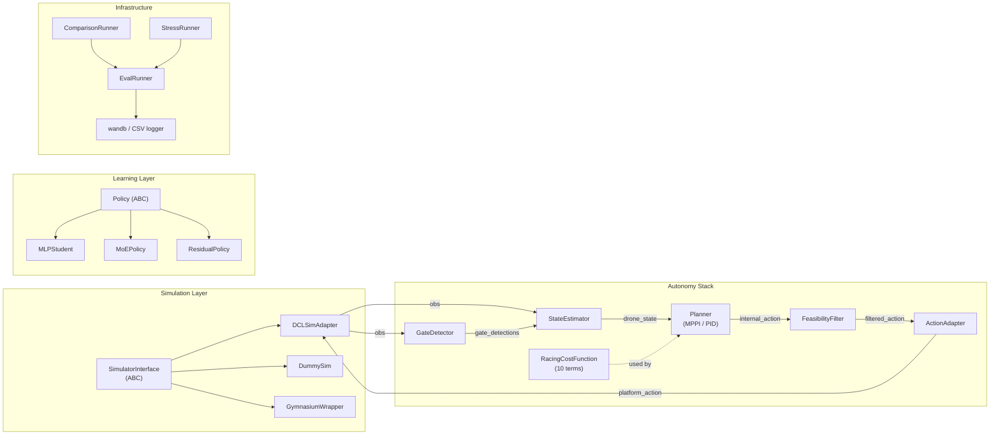

# Implementation Plan: Autonomous Drone Racing

This document is the software engineering counterpart to `writeup.md`. It specifies what code to write, in what order, with what interfaces. Every component maps to a section of the technical writeup; cross-references are provided throughout.

---

## Table of Contents

1. [Architecture Overview](#1-architecture-overview)
2. [Project Structure](#2-project-structure)
3. [Core Types](#3-core-types)
4. [Interface Specifications](#4-interface-specifications)
5. [Module Implementation Details](#5-module-implementation-details)
6. [Evaluation Framework](#6-evaluation-framework)
7. [Training Pipelines](#7-training-pipelines)
8. [Configuration Schema](#8-configuration-schema)
9. [Sprint-Based Build Order](#9-sprint-based-build-order)
10. [Dependencies](#10-dependencies)

---

## 1. Architecture Overview

The system is organized around **six abstract interfaces** that decouple every major subsystem. Each interface has a Hydra-compatible registry so implementations can be swapped via config without touching code. The architecture directly mirrors the pipeline from `writeup.md` Section 4.1.



**Design principles:**

- **Plug-and-play simulation.** Every sim implements `SimulatorInterface`. Switching from `DummySim` to `DCLSimAdapter` is a one-line config change (`sim=dcl`).
- **Algorithm interchangeability.** Planners and policies share a common action interface. Comparing MPPI vs. PID vs. MLP student vs. MoE is a Hydra multirun: `planner=mppi,pid,student,moe --multirun`.
- **Automated evaluation.** Every run logs to wandb. Comparison and stress-test runners produce structured tables and charts without manual work.
- **Reproducibility.** Hydra captures the full config for every run. Combined with git hashes and random seeds, any result can be reproduced exactly.

---

## 2. Project Structure

```
automated-drone-racing/
├── configs/                           # Hydra configuration
│   ├── config.yaml                    # Root config with defaults list
│   ├── sim/
│   │   ├── dcl.yaml
│   │   └── dummy.yaml
│   ├── planner/
│   │   ├── mppi.yaml
│   │   ├── pid.yaml
│   │   ├── student.yaml
│   │   └── moe.yaml
│   ├── perception/
│   │   ├── classical.yaml
│   │   └── cnn.yaml
│   ├── estimator/
│   │   ├── passthrough.yaml
│   │   └── ekf.yaml
│   ├── cost/
│   │   └── default.yaml
│   ├── training/
│   │   ├── distillation.yaml
│   │   ├── moe.yaml
│   │   └── residual_rl.yaml
│   └── eval/
│       ├── default.yaml
│       ├── ablation.yaml
│       └── stress.yaml
│
├── src/
│   └── drone_racing/
│       ├── __init__.py
│       ├── core/                      # Core data types and interfaces
│       │   ├── __init__.py
│       │   ├── types.py               # Frozen dataclasses
│       │   ├── interfaces.py          # 6 ABCs
│       │   └── registry.py            # Hydra instantiate helpers
│       │
│       ├── sim/                       # Simulation adapters
│       │   ├── __init__.py
│       │   ├── dcl.py                 # DCL platform adapter
│       │   ├── dummy.py               # Minimal test sim
│       │   └── gymnasium.py           # Gymnasium wrapper for RL
│       │
│       ├── perception/                # Gate detection
│       │   ├── __init__.py
│       │   ├── classical.py           # HSV + contour + rectangle
│       │   ├── cnn.py                 # MobileNet-v3-Small fallback
│       │   └── pnp.py                 # PnP solver utility
│       │
│       ├── estimation/                # State estimation
│       │   ├── __init__.py
│       │   ├── passthrough.py         # Direct sim state
│       │   └── ekf.py                 # EKF with gate landmarks
│       │
│       ├── planning/                  # Planning and cost
│       │   ├── __init__.py
│       │   ├── mppi.py                # MPPI planner (wraps pytorch-mppi)
│       │   ├── pid.py                 # PID waypoint follower baseline
│       │   ├── cost.py                # RacingCostFunction (10 terms)
│       │   └── dynamics.py            # Quadrotor dynamics model
│       │
│       ├── control/                   # Low-level control
│       │   ├── __init__.py
│       │   ├── adapter.py             # Action space adapter
│       │   └── feasibility.py         # Feasibility filter
│       │
│       ├── policy/                    # Learned policies
│       │   ├── __init__.py
│       │   ├── mlp.py                 # MLP student
│       │   ├── moe.py                 # Mixture-of-Experts
│       │   └── residual.py            # Residual RL wrapper
│       │
│       ├── training/                  # Training pipelines
│       │   ├── __init__.py
│       │   ├── data_collection.py     # Teacher rollout logger
│       │   ├── distillation.py        # BC + DAgger loop
│       │   ├── moe_training.py        # MoE-specific training
│       │   ├── rl_training.py         # SB3 residual RL
│       │   └── domain_randomization.py
│       │
│       ├── evaluation/                # Evaluation framework
│       │   ├── __init__.py
│       │   ├── runner.py              # Single-config eval loop
│       │   ├── metrics.py             # Metric computation
│       │   ├── comparison.py          # Multi-config comparison
│       │   └── stress.py              # Stress testing sweeps
│       │
│       ├── track/                     # Track and gate logic
│       │   ├── __init__.py
│       │   ├── gate.py                # Gate geometry + progress
│       │   └── ordering.py            # Gate sequencing + validity
│       │
│       └── utils/                     # Shared utilities
│           ├── __init__.py
│           ├── logging.py             # wandb + CSV logger
│           ├── math.py                # Quaternion ops, rotations
│           └── timing.py              # Profiling helpers
│
├── scripts/                           # Entry points
│   ├── run.py                         # Fly the full pipeline
│   ├── train.py                       # Training entry point
│   ├── eval.py                        # Evaluation entry point
│   ├── compare.py                     # Algorithm comparison
│   └── collect_data.py                # Teacher data collection
│
├── tests/                             # Unit and integration tests
│   ├── test_types.py
│   ├── test_cost.py
│   ├── test_mppi.py
│   ├── test_perception.py
│   ├── test_dummy_sim.py
│   └── test_eval_runner.py
│
├── pyproject.toml
├── writeup.md
└── implementation.md                  # This file
```

---

## 3. Core Types

All core data types are frozen dataclasses in `src/drone_racing/core/types.py`. They form the lingua franca between all modules. No module imports another module's internals; they communicate exclusively through these types.

```python
from __future__ import annotations
import numpy as np
from dataclasses import dataclass, field
from enum import Enum, auto


class ActionSpaceType(Enum):
    ROTOR_THRUSTS = auto()       # u in R^4 (individual motor thrusts)
    THRUST_BODY_RATES = auto()   # (T, omega_x, omega_y, omega_z)
    ACCEL_YAW_RATE = auto()      # (a_x, a_y, a_z, yaw_dot)


@dataclass(frozen=True)
class DroneState:
    position: np.ndarray         # (3,) world frame [x, y, z] meters
    velocity: np.ndarray         # (3,) world frame [vx, vy, vz] m/s
    quaternion: np.ndarray       # (4,) [qw, qx, qy, qz] unit quaternion
    angular_velocity: np.ndarray # (3,) body frame [p, q, r] rad/s
    timestamp: float             # seconds since episode start


@dataclass(frozen=True)
class GateSpec:
    gate_id: int
    position: np.ndarray         # (3,) world frame center
    orientation: np.ndarray      # (4,) quaternion defining gate normal
    width: float                 # meters
    height: float                # meters
    corners_3d: np.ndarray       # (4, 3) known 3D corners for PnP


@dataclass(frozen=True)
class GateDetection:
    gate_id: int | None          # None if association unknown
    corners_2d: np.ndarray       # (4, 2) detected image corners
    pose: np.ndarray | None      # (4, 4) SE(3) transform, None if PnP failed
    confidence: float            # [0, 1]


@dataclass(frozen=True)
class GateInfo:
    """Current gate targeting information passed to planners."""
    target_gate: GateSpec
    relative_position: np.ndarray  # (3,) gate center in body frame
    relative_orientation: np.ndarray  # (4,) gate quaternion in body frame
    gate_normal: np.ndarray        # (3,) world-frame unit normal
    progress: float                # [0, 1] normalized course progress
    gates_remaining: int


@dataclass(frozen=True)
class Action:
    """Internal action representation: desired acceleration + yaw rate."""
    acceleration: np.ndarray     # (3,) desired world-frame acceleration m/s^2
    yaw_rate: float              # desired yaw rate rad/s
    raw: np.ndarray | None = None  # platform-native action (filled by adapter)


@dataclass(frozen=True)
class Observation:
    """Raw observation from the simulator."""
    image: np.ndarray | None     # (H, W, 3) RGB or None if not provided
    imu_accel: np.ndarray | None # (3,) accelerometer
    imu_gyro: np.ndarray | None  # (3,) gyroscope
    state: DroneState | None     # privileged state, None if not provided
    gate_poses: list[GateSpec] | None  # privileged gate info, None if not provided
    timestamp: float


@dataclass
class EpisodeMetrics:
    """Collected after each evaluation episode."""
    lap_time: float | None       # None if did not finish
    gates_passed: int
    gates_total: int
    gate_pass_rate: float
    crashed: bool
    crash_reason: str | None
    saturation_fraction: float   # fraction of timesteps near actuator limits
    jerk_integral: float         # integral of ||d^3 p / dt^3||^2
    total_steps: int
    mean_speed: float            # m/s
    max_speed: float             # m/s


@dataclass
class TeacherDatum:
    """Single data point from teacher rollout."""
    state: DroneState
    gate_info: GateInfo
    action: Action
    cost_to_go: float
    regime_label: int            # expert index for MoE supervision
```

---

## 4. Interface Specifications

Six abstract base classes in `src/drone_racing/core/interfaces.py`. Every implementation in the project inherits from exactly one of these. Hydra's `instantiate()` creates the correct concrete class from config.

### 4.1 SimulatorInterface

The simulation boundary. Every simulator -- DCL, DummySim, third-party -- implements this single interface. The `GymnasiumWrapper` adapts it for SB3.

```python
from abc import ABC, abstractmethod

class SimulatorInterface(ABC):
    """Abstract simulation environment.

    Implementations: DCLSimAdapter, DummySim.
    Ref: writeup.md Section 4.1, Section 1.6 (Known Unknowns).
    """

    @abstractmethod
    def reset(self, seed: int | None = None) -> Observation:
        """Reset environment. Returns initial observation."""
        ...

    @abstractmethod
    def step(self, action: np.ndarray) -> tuple[Observation, float, bool, bool, dict]:
        """Execute one timestep.

        Args:
            action: Platform-native action array (shape depends on action_space_type).

        Returns:
            observation: New observation.
            reward: Scalar reward (0.0 for non-RL use).
            terminated: True if episode ended normally (finished course).
            truncated: True if episode ended abnormally (crash, timeout).
            info: Dict with at least {"gate_passed": bool, "gate_id": int | None}.
        """
        ...

    @abstractmethod
    def get_gate_specs(self) -> list[GateSpec]:
        """Return ordered list of gate specifications for the current track."""
        ...

    @abstractmethod
    def close(self) -> None:
        """Release simulator resources."""
        ...

    @property
    @abstractmethod
    def action_space_type(self) -> ActionSpaceType:
        """Which action modality the platform uses."""
        ...

    @property
    @abstractmethod
    def control_dt(self) -> float:
        """Seconds between control steps."""
        ...

    @property
    @abstractmethod
    def has_privileged_state(self) -> bool:
        """Whether observations include ground-truth drone state."""
        ...
```

**Key contract:** the `step()` signature follows the Gymnasium convention (5-tuple) so the `GymnasiumWrapper` is a thin translation layer, not a redesign.

### 4.2 GateDetector

Perception module. Takes an image, returns gate detections with confidence.

```python
class GateDetector(ABC):
    """Abstract gate detection from camera imagery.

    Implementations: ClassicalDetector, CNNDetector.
    Ref: writeup.md Section 4.2.
    """

    @abstractmethod
    def detect(self, image: np.ndarray, camera_matrix: np.ndarray) -> list[GateDetection]:
        """Detect gates in a single camera frame.

        Args:
            image: (H, W, 3) uint8 RGB image.
            camera_matrix: (3, 3) camera intrinsic matrix K.

        Returns:
            List of GateDetection, possibly empty.
        """
        ...

    @abstractmethod
    def set_gate_model(self, gate_spec: GateSpec) -> None:
        """Configure the detector with known gate geometry for PnP."""
        ...
```

### 4.3 StateEstimator

Fuses observations into a consistent drone state. Designed as a swappable boundary: `PassthroughEstimator` when sim gives privileged state, `EKFEstimator` when it does not.

```python
class StateEstimator(ABC):
    """Abstract state estimator.

    Implementations: PassthroughEstimator, EKFEstimator.
    Ref: writeup.md Section 3.2, Section 1.6.
    """

    @abstractmethod
    def update(self, observation: Observation,
               gate_detections: list[GateDetection] | None = None) -> DroneState:
        """Incorporate new sensor data and return best state estimate.

        Args:
            observation: Raw observation from simulator.
            gate_detections: Optional gate detections for landmark correction.

        Returns:
            Current best estimate of drone state.
        """
        ...

    @abstractmethod
    def predict(self, dt: float) -> DroneState:
        """Forward-predict state by dt seconds (for latency compensation).

        Ref: writeup.md Section 2.2 (AlphaPilot latency compensation).
        """
        ...

    @abstractmethod
    def reset(self) -> None:
        """Reset estimator state for new episode."""
        ...
```

### 4.4 Planner

Computes actions from state + gate info. Both classical (MPPI, PID) and learned (student, MoE) planners implement this, allowing seamless comparison.

```python
class Planner(ABC):
    """Abstract planner / controller.

    Implementations: MPPIPlanner, PIDPlanner.
    Learned policies also implement this via PolicyPlanner adapter.
    Ref: writeup.md Section 4.4.
    """

    @abstractmethod
    def compute_action(self, state: DroneState, gate_info: GateInfo) -> Action:
        """Compute a single control action.

        Args:
            state: Current drone state estimate.
            gate_info: Current gate targeting information.

        Returns:
            Action with desired acceleration and yaw rate.
        """
        ...

    @abstractmethod
    def reset(self) -> None:
        """Reset planner state (warm-start buffers, etc.) for new episode."""
        ...
```

### 4.5 Policy

Unified interface for all learned policies. Separate from `Planner` because policies have additional concerns (load/save, train/eval mode, gradient computation). A `PolicyPlanner` adapter bridges `Policy` to the `Planner` interface for evaluation.

```python
class Policy(ABC):
    """Abstract learned policy.

    Implementations: MLPStudent, MoEPolicy, ResidualPolicy.
    Ref: writeup.md Sections 5.1, 5.2, 5.3.
    """

    @abstractmethod
    def get_action(self, state: DroneState, gate_info: GateInfo) -> Action:
        """Compute action from current state (inference mode)."""
        ...

    @abstractmethod
    def get_action_train(self, state_tensor: torch.Tensor) -> tuple[torch.Tensor, dict]:
        """Compute action during training (returns tensor + aux info for loss).

        Args:
            state_tensor: (batch, state_dim) tensor.

        Returns:
            action_tensor: (batch, action_dim) tensor.
            aux: dict with keys like "gate_logits", "value", etc.
        """
        ...

    @abstractmethod
    def state_to_tensor(self, state: DroneState, gate_info: GateInfo) -> torch.Tensor:
        """Convert DroneState + GateInfo to flat input tensor."""
        ...

    @abstractmethod
    def save(self, path: str) -> None:
        ...

    @abstractmethod
    def load(self, path: str) -> None:
        ...

    @abstractmethod
    def train_mode(self, mode: bool = True) -> None:
        """Switch between training and inference mode."""
        ...
```

### 4.6 ActionAdapter

The lowest layer: translates our internal `Action` (desired acceleration + yaw rate) to whatever the platform expects. This is the **only component that changes** when the competition API is released.

```python
class ActionAdapter(ABC):
    """Maps internal action representation to platform-native commands.

    Implementations: AccelYawAdapter (passthrough), ThrustBodyRateAdapter,
                     RotorThrustAdapter.
    Ref: writeup.md Section 4.3 (action interface discussion).
    """

    @abstractmethod
    def adapt(self, action: Action, state: DroneState) -> np.ndarray:
        """Convert internal Action to platform-native command array.

        Args:
            action: Internal action (acceleration + yaw rate).
            state: Current state (needed for attitude-dependent mappings).

        Returns:
            Platform-native action array ready for SimulatorInterface.step().
        """
        ...

    @property
    @abstractmethod
    def output_space_type(self) -> ActionSpaceType:
        ...
```

---

## 5. Module Implementation Details

### 5.1 Simulation Adapters

#### DummySim (`sim/dummy.py`)

Minimal 6-DoF rigid body with linear drag. No rendering, no gate visuals. Used for:
- Unit testing every module without the DCL simulator
- Fast iteration on cost function tuning
- Sanity-checking planner behavior

Physics: double-integrator with configurable drag, mass, inertia, and actuator limits. Gates are defined as oriented rectangular planes. "Gate passed" is detected by checking if the drone crosses the gate plane within the aperture between consecutive timesteps. Privileged state is always available.

#### DCLSimAdapter (`sim/dcl.py`)

Wraps the DCL competition platform. This is a **stub** until the API is released. The structure will be:

```python
class DCLSimAdapter(SimulatorInterface):
    def __init__(self, cfg):
        # Connect to DCL process / shared memory / socket
        # Parse observation format from API spec
        # Determine action_space_type from API spec
        ...

    def step(self, action):
        # Send action to DCL
        # Receive observation
        # Parse into our Observation type
        # Detect gate passage from DCL info dict
        ...
```

The adapter handles all DCL-specific concerns (connection management, serialization, timing) and exposes the clean `SimulatorInterface` to the rest of the stack.

#### GymnasiumWrapper (`sim/gymnasium.py`)

Wraps any `SimulatorInterface` into a `gymnasium.Env` for SB3 compatibility.

```python
class DroneRacingEnv(gymnasium.Env):
    def __init__(self, sim: SimulatorInterface, reward_fn, domain_randomizer=None):
        self.sim = sim
        self.reward_fn = reward_fn
        self.domain_randomizer = domain_randomizer
        # Define observation_space and action_space from sim properties

    def reset(self, seed=None, options=None):
        obs = self.sim.reset(seed=seed)
        if self.domain_randomizer:
            self.domain_randomizer.randomize(self.sim)
        return self._obs_to_array(obs), {}

    def step(self, action):
        obs, _, terminated, truncated, info = self.sim.step(action)
        reward = self.reward_fn(obs, action, info)
        return self._obs_to_array(obs), reward, terminated, truncated, info
```

### 5.2 Perception

#### ClassicalDetector (`perception/classical.py`)

Implements the pipeline from `writeup.md` Section 4.2:

1. RGB to HSV conversion
2. Color thresholding (configurable hue/saturation/value ranges)
3. Morphological open/close
4. Contour extraction (Suzuki-Abe via `cv2.findContours`)
5. Rectangle fitting (`cv2.minAreaRect`) with aspect ratio / area / convexity filters
6. Corner extraction (ordered: top-left, top-right, bottom-right, bottom-left)
7. PnP solve via `pnp.py`

All thresholds are Hydra-configurable. Returns `list[GateDetection]`.

#### PnP Solver (`perception/pnp.py`)

Standalone utility wrapping `cv2.solvePnP`:

```python
def solve_gate_pose(
    corners_2d: np.ndarray,      # (4, 2)
    corners_3d: np.ndarray,      # (4, 3)
    camera_matrix: np.ndarray,   # (3, 3)
    dist_coeffs: np.ndarray | None = None,
    method: int = cv2.SOLVEPNP_IPPE_SQUARE,
) -> tuple[np.ndarray, float]:
    """Returns (4x4 SE(3) transform, reprojection_error)."""
    ...
```

Uses `SOLVEPNP_IPPE_SQUARE` (optimized for square/rectangular coplanar points) as default, consistent with Swift's IPPE approach (`writeup.md` Section 2.2).

#### CNNDetector (`perception/cnn.py`)

MobileNet-v3-Small backbone with a corner regression head. Stub in Sprint 2; full implementation in Sprint 5 if needed. Interface:

```python
class CNNDetector(GateDetector):
    def __init__(self, model_path: str | None, device: str = "cuda"):
        # Load pretrained or initialize
        ...

    def detect(self, image, camera_matrix):
        # Resize to 224x224
        # Forward pass -> (N, 8) corner coordinates + (N, 1) confidence
        # PnP solve per detection
        ...
```

### 5.3 State Estimation

#### PassthroughEstimator (`estimation/passthrough.py`)

For use when the simulator provides privileged state. Trivial implementation:

```python
class PassthroughEstimator(StateEstimator):
    def update(self, observation, gate_detections=None):
        return observation.state  # Direct pass-through

    def predict(self, dt):
        # Simple kinematic forward prediction using last known state
        ...

    def reset(self):
        self._last_state = None
```

#### EKFEstimator (`estimation/ekf.py`)

Extended Kalman Filter for physical stages. State: `[p, v, q, omega, bias_accel, bias_gyro]` (22 dimensions). Measurement models:

- **IMU propagation** at IMU rate (prediction step)
- **Gate landmark updates** when detections are available (correction step)
- **VIO updates** if a VIO backbone is running (correction step)

Implements drift-state filtering consistent with the Swift pattern (`writeup.md` Section 2.2): estimates translational drift and drift velocity, subtracts from VIO estimates.

### 5.4 Planning

#### RacingCostFunction (`planning/cost.py`)

All 10 cost terms from `writeup.md` Sections 4.5.1--4.5.10, implemented as a single callable class:

```python
class RacingCostFunction:
    """Multi-objective racing cost function.

    Terms (ref writeup.md Section 4.5):
      1. Progress        - reward forward motion toward gate
      2. Gate alignment   - penalize lateral offset from gate center
      3. Clearance margin - penalize proximity to gate frame
      4. Saturation       - penalize actuator usage above threshold
      5. Smoothness       - penalize control jerk
      6. Attitude limit   - penalize excessive tilt
      7. Crash            - large constant on collision
      8. Gate passage     - terminal bonus on crossing gate plane (Section 4.5.9)
      9. Perception-aware - penalize losing gate visibility (Section 4.5.10)
    """

    def __init__(self, weights: CostWeights, gate_spec: GateSpec):
        self.w = weights
        self.gate = gate_spec

    def __call__(
        self,
        states: torch.Tensor,       # (K, H, state_dim)
        actions: torch.Tensor,      # (K, H, action_dim)
        gate_info: GateInfo,
    ) -> torch.Tensor:              # (K,) total cost per trajectory
        ...

    def progress_cost(self, states, gate_info) -> torch.Tensor: ...
    def alignment_cost(self, states, gate_info) -> torch.Tensor: ...
    def clearance_cost(self, states, gate_info) -> torch.Tensor: ...
    def saturation_cost(self, actions) -> torch.Tensor: ...
    def smoothness_cost(self, actions) -> torch.Tensor: ...
    def tilt_cost(self, states) -> torch.Tensor: ...
    def crash_cost(self, states) -> torch.Tensor: ...
    def gate_passage_bonus(self, states, gate_info) -> torch.Tensor: ...
    def visibility_cost(self, states, gate_info) -> torch.Tensor: ...
```

The `CostWeights` dataclass holds all weight hyperparameters and is populated from `configs/cost/default.yaml`.

```python
@dataclass
class CostWeights:
    w_progress: float = 10.0
    w_gate: float = 5.0
    w_clearance: float = 3.0
    w_saturation: float = 2.0
    w_smoothness: float = 1.0
    w_tilt: float = 2.0
    w_crash: float = 1000.0
    w_gate_passage: float = 50.0
    w_visibility: float = 0.0     # disabled by default
    saturation_margin: float = 0.85
    clearance_margin: float = 0.1  # meters
    tilt_limit: float = 1.0       # radians (~57 degrees)
```

#### MPPIPlanner (`planning/mppi.py`)

Wraps `pytorch-mppi` with our `RacingCostFunction` and dynamics model. Implements the `Planner` interface.

```python
class MPPIPlanner(Planner):
    def __init__(self, cfg: MPPIConfig, cost_fn: RacingCostFunction,
                 dynamics: QuadrotorDynamics):
        self.mppi = MPPI(
            dynamics=dynamics.step_batch,
            running_cost=self._running_cost,
            nx=dynamics.state_dim,
            noise_sigma=torch.diag(torch.tensor(cfg.noise_sigma)),
            num_samples=cfg.num_samples,    # K
            horizon=cfg.horizon,            # H
            lambda_=cfg.temperature,        # lambda
            u_min=torch.tensor(cfg.u_min),
            u_max=torch.tensor(cfg.u_max),
            device=cfg.device,
        )
        self.cost_fn = cost_fn
        self.dynamics = dynamics

    def compute_action(self, state, gate_info):
        state_tensor = self._state_to_tensor(state, gate_info)
        action_tensor = self.mppi.command(state_tensor)
        return Action(
            acceleration=action_tensor[:3].cpu().numpy(),
            yaw_rate=action_tensor[3].item(),
        )

    def reset(self):
        self.mppi.reset()
```

#### QuadrotorDynamics (`planning/dynamics.py`)

Simplified quadrotor dynamics model for MPPI rollouts. Implements `f(x, u) -> x_next`.

```python
class QuadrotorDynamics:
    """6-DoF quadrotor dynamics for MPPI forward rollouts.

    State: [p(3), v(3), q(4), omega(3)] = 13 dims
    Input: [ax, ay, az, yaw_dot] = 4 dims
    """

    def __init__(self, cfg: DynamicsConfig):
        self.mass = cfg.mass
        self.inertia = np.diag(cfg.inertia)
        self.drag_coeff = cfg.drag_coeff
        self.dt = cfg.dt
        self.gravity = np.array([0, 0, -9.81])

    def step_batch(self, state: torch.Tensor, action: torch.Tensor) -> torch.Tensor:
        """Batched dynamics step for MPPI. Runs on GPU."""
        # state: (K, 13), action: (K, 4)
        # Semi-implicit Euler integration
        ...

    @property
    def state_dim(self) -> int:
        return 13

    @property
    def action_dim(self) -> int:
        return 4
```

#### PIDPlanner (`planning/pid.py`)

Cascaded PID baseline (position -> velocity -> attitude -> rate). Tracks waypoints at gate centers. Used as a lower-bound comparison in ablation studies (`writeup.md` Section 6.4).

### 5.5 Control

#### FeasibilityFilter (`control/feasibility.py`)

Post-planner filter from `writeup.md` Section 4.1.

```python
class FeasibilityFilter:
    def __init__(self, cfg: FeasibilityConfig):
        self.max_accel = cfg.max_accel        # m/s^2
        self.max_yaw_rate = cfg.max_yaw_rate  # rad/s
        self.max_tilt = cfg.max_tilt          # radians

    def filter(self, action: Action, state: DroneState) -> Action:
        """Clamp action to feasible region. Returns modified Action."""
        accel = np.clip(action.acceleration, -self.max_accel, self.max_accel)
        yaw = np.clip(action.yaw_rate, -self.max_yaw_rate, self.max_yaw_rate)

        # Check if resulting tilt would exceed limit
        # If so, reduce horizontal acceleration magnitude
        ...

        return Action(acceleration=accel, yaw_rate=yaw)
```

#### ActionAdapter implementations (`control/adapter.py`)

Three concrete adapters, one per `ActionSpaceType`:

```python
class AccelYawAdapter(ActionAdapter):
    """Passthrough: internal representation matches platform."""
    def adapt(self, action, state):
        return np.concatenate([action.acceleration, [action.yaw_rate]])

class ThrustBodyRateAdapter(ActionAdapter):
    """Maps desired accel + yaw_rate to collective thrust + body rates."""
    def adapt(self, action, state):
        # Compute desired thrust from accel + gravity
        # Compute desired attitude from thrust direction
        # Compute body rates from current vs desired attitude
        ...

class RotorThrustAdapter(ActionAdapter):
    """Maps desired accel + yaw_rate to individual rotor thrusts."""
    def adapt(self, action, state):
        # Compute collective thrust and torques
        # Apply mixer matrix to get per-rotor thrusts
        ...
```

### 5.6 Track Logic

#### Gate Progress (`track/gate.py`)

Computes progress scalars, gate-relative transforms, and plane-crossing detection.

```python
def compute_gate_info(
    state: DroneState,
    target_gate: GateSpec,
    track: list[GateSpec],
    current_gate_idx: int,
) -> GateInfo:
    """Compute gate-relative state for planner/policy input."""
    ...

def check_gate_passage(
    prev_pos: np.ndarray,
    curr_pos: np.ndarray,
    gate: GateSpec,
    margin: float = 0.0,
) -> bool:
    """Check if drone crossed gate plane within aperture between two positions."""
    ...
```

#### Gate Ordering (`track/ordering.py`)

Manages the gate sequencing state machine from `writeup.md` Section 6.5 (failure taxonomy: missed gate association).

```python
class GateOrderTracker:
    def __init__(self, gates: list[GateSpec], allow_skip: bool = False):
        self.gates = gates
        self.current_idx = 0
        self.passed = []
        self.allow_skip = allow_skip

    def update(self, prev_pos, curr_pos) -> dict:
        """Check for gate passage events. Returns info dict."""
        # Check current target gate
        # Optionally check next gate (for skip detection)
        # Advance index on passage
        ...

    @property
    def target_gate(self) -> GateSpec:
        return self.gates[self.current_idx]

    @property
    def finished(self) -> bool:
        return self.current_idx >= len(self.gates)
```

### 5.7 Learned Policies

#### MLPStudent (`policy/mlp.py`)

From `writeup.md` Section 5.1.

```python
class MLPStudent(Policy):
    def __init__(self, cfg: MLPConfig):
        self.net = nn.Sequential(
            nn.Linear(cfg.input_dim, 128),
            nn.LayerNorm(128),
            nn.ReLU(),
            nn.Linear(128, 128),
            nn.LayerNorm(128),
            nn.ReLU(),
            nn.Linear(128, cfg.action_dim),
        )
        if cfg.use_value_head:
            self.value_head = nn.Linear(128, 1)

    def get_action_train(self, state_tensor):
        h = self._backbone(state_tensor)  # shared layers
        action = self.action_head(h)
        aux = {}
        if self.value_head:
            aux["value"] = self.value_head(h)
        return action, aux
```

Input dimension: 3 (pos) + 3 (vel) + 4 (quat) + 3 (omega) + 6 (gate rel) + 1 (progress) = **20**.
Output dimension: 3 (accel) + 1 (yaw rate) = **4**.

#### MoEPolicy (`policy/moe.py`)

From `writeup.md` Section 5.2.

```python
class MoEPolicy(Policy):
    def __init__(self, cfg: MoEConfig):
        self.num_experts = cfg.num_experts  # typically 5
        self.experts = nn.ModuleList([
            nn.Sequential(
                nn.Linear(cfg.input_dim, 64),
                nn.ReLU(),
                nn.Linear(64, cfg.action_dim),
            )
            for _ in range(cfg.num_experts)
        ])
        self.gate = nn.Sequential(
            nn.Linear(cfg.input_dim, 64),
            nn.ReLU(),
            nn.Linear(64, cfg.num_experts),
        )

    def get_action(self, state, gate_info):
        x = self.state_to_tensor(state, gate_info)
        gate_logits = self.gate(x)
        expert_idx = gate_logits.argmax(dim=-1)  # hard routing at inference
        return self.experts[expert_idx](x)

    def get_action_train(self, state_tensor):
        gate_logits = self.gate(state_tensor)
        gate_probs = F.softmax(gate_logits, dim=-1)
        expert_outputs = torch.stack([e(state_tensor) for e in self.experts], dim=1)
        # Soft routing during training: weighted sum
        action = (gate_probs.unsqueeze(-1) * expert_outputs).sum(dim=1)
        aux = {
            "gate_logits": gate_logits,
            "gate_probs": gate_probs,
            "expert_outputs": expert_outputs,
        }
        return action, aux

    def load_balance_loss(self, gate_probs: torch.Tensor) -> torch.Tensor:
        """Switch Transformer-style load balancing (ref [29])."""
        # gate_probs: (batch, K)
        f = gate_probs.mean(dim=0)         # fraction routed to each expert
        p = gate_probs.mean(dim=0)         # avg probability per expert
        return self.num_experts * (f * p).sum()
```

#### ResidualPolicy (`policy/residual.py`)

From `writeup.md` Section 5.3. Wraps a frozen base policy and adds a learned residual.

```python
class ResidualPolicy(Policy):
    def __init__(self, base_policy: Policy, residual_net: nn.Module,
                 residual_scale: float = 0.1):
        self.base = base_policy
        self.base.train_mode(False)  # freeze base
        self.residual = residual_net
        self.scale = residual_scale

    def get_action(self, state, gate_info):
        with torch.no_grad():
            base_action = self.base.get_action(state, gate_info)
        x = self.state_to_tensor(state, gate_info)
        delta = self.residual(x) * self.scale
        return Action(
            acceleration=base_action.acceleration + delta[:3].numpy(),
            yaw_rate=base_action.yaw_rate + delta[3].item(),
        )
```

---

## 6. Evaluation Framework

The evaluation framework is a three-level system that supports single-run evaluation, multi-algorithm comparison, and parametric stress testing. All results are logged to wandb.

### 6.1 EvalRunner (`evaluation/runner.py`)

Core evaluation loop. Runs N episodes of a fully assembled pipeline and computes the five metrics from `writeup.md` Section 6.1.

```python
class EvalRunner:
    def __init__(self, sim, perception, estimator, planner, adapter,
                 feasibility_filter, gate_tracker, logger, cfg):
        ...

    def run_episode(self) -> EpisodeMetrics:
        """Run a single episode and return metrics."""
        obs = self.sim.reset()
        self.gate_tracker.reset()
        self.estimator.reset()
        self.planner.reset()

        step_data = []
        while not done:
            # Perception (if image available)
            detections = self.perception.detect(obs.image, K) if obs.image else []

            # State estimation
            state = self.estimator.update(obs, detections)
            gate_info = compute_gate_info(state, self.gate_tracker.target_gate, ...)

            # Planning
            action = self.planner.compute_action(state, gate_info)

            # Feasibility filter
            action = self.feasibility_filter.filter(action, state)

            # Action adaptation
            platform_action = self.adapter.adapt(action, state)

            # Environment step
            obs, _, terminated, truncated, info = self.sim.step(platform_action)

            # Gate tracking
            self.gate_tracker.update(prev_pos, state.position)

            # Log step data for metrics
            step_data.append(...)

        return compute_metrics(step_data, self.gate_tracker)

    def evaluate(self, num_episodes: int) -> dict:
        """Run N episodes and return aggregated metrics."""
        all_metrics = [self.run_episode() for _ in range(num_episodes)]
        summary = aggregate_metrics(all_metrics)
        self.logger.log(summary)
        return summary
```

### 6.2 Metrics (`evaluation/metrics.py`)

Computes the five metrics from `writeup.md` Section 6.1:

```python
def compute_metrics(step_data: list[StepRecord],
                    gate_tracker: GateOrderTracker) -> EpisodeMetrics:
    """Compute all metrics from recorded step data."""
    lap_time = step_data[-1].timestamp if gate_tracker.finished else None
    gate_pass_rate = gate_tracker.current_idx / len(gate_tracker.gates)
    crashed = any(s.collision for s in step_data)

    # Saturation fraction: fraction of steps where ||u|| / u_max > margin
    sat_frac = np.mean([s.saturation_ratio > 0.85 for s in step_data])

    # Jerk integral: sum of ||a_t - a_{t-1}||^2 * dt
    accels = np.array([s.acceleration for s in step_data])
    jerk = np.sum(np.diff(accels, axis=0) ** 2) * step_data[0].dt

    return EpisodeMetrics(
        lap_time=lap_time,
        gates_passed=gate_tracker.current_idx,
        gates_total=len(gate_tracker.gates),
        gate_pass_rate=gate_pass_rate,
        crashed=crashed,
        crash_reason=...,
        saturation_fraction=sat_frac,
        jerk_integral=jerk,
        total_steps=len(step_data),
        mean_speed=np.mean([s.speed for s in step_data]),
        max_speed=np.max([s.speed for s in step_data]),
    )
```

### 6.3 ComparisonRunner (`evaluation/comparison.py`)

Runs `EvalRunner` across multiple configurations and produces comparison tables. Integrates with Hydra multirun.

```python
class ComparisonRunner:
    def __init__(self, configs: list[tuple[str, DictConfig]], num_episodes: int):
        self.configs = configs
        self.num_episodes = num_episodes

    def run(self) -> pd.DataFrame:
        """Run all configs and return comparison DataFrame."""
        results = []
        for name, cfg in self.configs:
            pipeline = build_pipeline(cfg)  # Hydra instantiate
            runner = EvalRunner(**pipeline)
            summary = runner.evaluate(self.num_episodes)
            summary["config_name"] = name
            results.append(summary)

        df = pd.DataFrame(results)
        self._log_comparison_table(df)
        return df
```

**Usage via CLI:**

```bash
# Compare 4 planners, 50 episodes each
python scripts/compare.py \
    planner=mppi,pid,student,moe \
    eval.num_episodes=50 \
    --multirun

# Full ablation study (6 configs from writeup Section 6.2)
python scripts/compare.py \
    --config-name=ablation \
    eval.num_episodes=50
```

### 6.4 StressRunner (`evaluation/stress.py`)

Parametric sweeps over perturbation axes from `writeup.md` Section 6.3.

```python
class StressRunner:
    SWEEP_AXES = {
        "wind_speed": [0, 2, 4, 6, 8],                    # m/s
        "imu_noise_scale": [1, 2, 4, 8],                  # multiplier
        "actuator_delay_ms": [0, 10, 20, 30, 50],         # ms
        "gate_position_noise_m": [0.0, 0.05, 0.10, 0.20], # meters
    }

    def sweep(self, axis: str, base_cfg: DictConfig,
              num_episodes: int = 20) -> pd.DataFrame:
        """Sweep one perturbation axis, evaluate at each level."""
        results = []
        for value in self.SWEEP_AXES[axis]:
            cfg = self._apply_perturbation(base_cfg, axis, value)
            runner = EvalRunner(**build_pipeline(cfg))
            summary = runner.evaluate(num_episodes)
            summary["perturbation_axis"] = axis
            summary["perturbation_value"] = value
            results.append(summary)
        return pd.DataFrame(results)
```

### 6.5 Logging (`utils/logging.py`)

Unified logger that writes to wandb and local CSV.

```python
class ExperimentLogger:
    def __init__(self, cfg: LogConfig):
        if cfg.use_wandb:
            wandb.init(
                project=cfg.wandb_project,
                name=cfg.run_name,
                config=OmegaConf.to_container(cfg, resolve=True),
                tags=cfg.tags,
            )
        self.csv_path = cfg.csv_path
        self.use_wandb = cfg.use_wandb

    def log_step(self, step: int, data: dict) -> None:
        if self.use_wandb:
            wandb.log(data, step=step)
        self._write_csv(data)

    def log_summary(self, data: dict) -> None:
        if self.use_wandb:
            wandb.summary.update(data)

    def log_table(self, name: str, df: pd.DataFrame) -> None:
        if self.use_wandb:
            wandb.log({name: wandb.Table(dataframe=df)})

    def finish(self) -> None:
        if self.use_wandb:
            wandb.finish()
```

---

## 7. Training Pipelines

### 7.1 Teacher Data Collection (`training/data_collection.py`)

Runs the MPPI teacher across diverse conditions and logs `(state, action, cost_to_go, regime_label)` tuples.

```python
class TeacherDataCollector:
    def __init__(self, sim, planner, estimator, gate_tracker, cfg):
        self.sim = sim
        self.planner = planner  # MPPI
        ...

    def collect(self, num_episodes: int, output_dir: str) -> None:
        """Run teacher and save dataset to disk."""
        dataset = []
        for ep in range(num_episodes):
            obs = self.sim.reset(seed=ep)
            ...
            while not done:
                state = self.estimator.update(obs)
                gate_info = compute_gate_info(state, ...)
                action = self.planner.compute_action(state, gate_info)
                cost_to_go = self.planner.get_cost_to_go()  # from MPPI
                regime = self._classify_regime(state, gate_info)

                dataset.append(TeacherDatum(
                    state=state, gate_info=gate_info,
                    action=action, cost_to_go=cost_to_go,
                    regime_label=regime,
                ))

                obs, _, terminated, truncated, _ = self.sim.step(...)
            ...

        self._save_dataset(dataset, output_dir)

    def _classify_regime(self, state, gate_info) -> int:
        """Assign regime label for MoE supervision.

        0: Aggressive (far from gate, aligned, fast)
        1: Precision (close to gate, threading)
        2: Recovery (high angular rates, large attitude error)
        3: Low authority (near saturation)
        4: Conservative (low confidence / fallback)
        """
        ...
```

**CLI:**

```bash
python scripts/collect_data.py \
    planner=mppi \
    sim=dummy \
    collection.num_episodes=500 \
    collection.output_dir=data/teacher_v1
```

### 7.2 Distillation (`training/distillation.py`)

Behavior cloning with DAgger, from `writeup.md` Section 5.1.

```python
class DistillationTrainer:
    def __init__(self, student: Policy, teacher: Planner,
                 sim: SimulatorInterface, cfg: DistillationConfig,
                 logger: ExperimentLogger):
        self.student = student
        self.teacher = teacher
        self.optimizer = torch.optim.Adam(student.parameters(), lr=cfg.lr)
        ...

    def train(self, dataset_path: str) -> None:
        dataset = load_teacher_dataset(dataset_path)

        for epoch in range(self.cfg.num_epochs):
            # --- Behavior Cloning phase ---
            for batch in DataLoader(dataset, batch_size=self.cfg.batch_size, shuffle=True):
                states, teacher_actions, costs_to_go = batch
                student_actions, aux = self.student.get_action_train(states)

                loss = self._compute_loss(
                    student_actions, teacher_actions, aux, costs_to_go
                )
                loss.backward()
                self.optimizer.step()
                self.optimizer.zero_grad()
                self.logger.log_step(self.global_step, {"train/loss": loss.item(), ...})

            # --- DAgger phase (every N epochs) ---
            if epoch % self.cfg.dagger_interval == 0 and epoch > 0:
                new_data = self._run_dagger(num_episodes=self.cfg.dagger_episodes)
                dataset = ConcatDataset([dataset, new_data])

            # --- Validation ---
            val_metrics = self._evaluate()
            self.logger.log_step(self.global_step, val_metrics)

    def _compute_loss(self, student_actions, teacher_actions, aux, costs_to_go):
        """Composite loss from writeup Section 5.1."""
        huber = F.huber_loss(student_actions, teacher_actions, delta=self.cfg.huber_delta)
        sat = saturation_penalty(student_actions, self.cfg.sat_margin)
        smooth = smoothness_penalty(student_actions)

        loss = huber + self.cfg.w_sat * sat + self.cfg.w_smooth * smooth

        if "value" in aux and costs_to_go is not None:
            value_loss = F.mse_loss(aux["value"].squeeze(), costs_to_go)
            loss += self.cfg.w_value * value_loss

        return loss

    def _run_dagger(self, num_episodes):
        """Execute student policy, relabel with teacher actions."""
        dagger_data = []
        for _ in range(num_episodes):
            obs = self.sim.reset()
            while not done:
                state = ...
                gate_info = ...
                # Student acts
                student_action = self.student.get_action(state, gate_info)
                # Teacher relabels
                teacher_action = self.teacher.compute_action(state, gate_info)
                dagger_data.append(TeacherDatum(
                    state=state, gate_info=gate_info,
                    action=teacher_action, ...
                ))
                # Step with student action (to visit student's distribution)
                obs, _, terminated, truncated, _ = self.sim.step(...)
        return TeacherDataset(dagger_data)
```

### 7.3 MoE Training (`training/moe_training.py`)

Extends distillation with gating loss and load-balancing, from `writeup.md` Section 5.2.

```python
class MoETrainer(DistillationTrainer):
    def _compute_loss(self, student_actions, teacher_actions, aux, costs_to_go):
        base_loss = super()._compute_loss(
            student_actions, teacher_actions, aux, costs_to_go
        )

        # Gating cross-entropy: supervise expert selection
        gate_ce = F.cross_entropy(aux["gate_logits"], batch_regime_labels)

        # Load-balancing loss (Switch Transformer style)
        balance = self.student.load_balance_loss(aux["gate_probs"])

        # Switching penalty: penalize expert changes between consecutive timesteps
        switch_penalty = self._switching_penalty(aux["gate_logits"])

        return (base_loss
                + self.cfg.w_gate_ce * gate_ce
                + self.cfg.w_balance * balance
                + self.cfg.w_switch * switch_penalty)
```

### 7.4 Residual RL (`training/rl_training.py`)

SB3 PPO/SAC training with a frozen base policy, from `writeup.md` Section 5.3.

```python
class ResidualRLTrainer:
    def __init__(self, base_policy: Policy, sim: SimulatorInterface,
                 cfg: RLConfig, logger: ExperimentLogger):
        self.base_policy = base_policy
        self.base_policy.train_mode(False)

        self.env = DroneRacingEnv(
            sim=sim,
            reward_fn=RacingRewardFunction(cfg.reward),
            domain_randomizer=DomainRandomizer(cfg.domain_rand),
        )

        self.model = PPO(
            "MlpPolicy",
            self.env,
            learning_rate=cfg.lr,
            n_steps=cfg.n_steps,
            batch_size=cfg.batch_size,
            gamma=cfg.gamma,
            verbose=1,
            device=cfg.device,
        ) if cfg.algorithm == "ppo" else SAC(...)

    def train(self, total_timesteps: int) -> None:
        callback = WandbCallback(self.logger)
        self.model.learn(
            total_timesteps=total_timesteps,
            callback=callback,
        )

    def export_residual_policy(self, output_path: str) -> ResidualPolicy:
        """Extract trained residual and wrap with base policy."""
        residual_net = self.model.policy.mlp_extractor  # or custom extraction
        policy = ResidualPolicy(self.base_policy, residual_net)
        policy.save(output_path)
        return policy
```

#### RacingRewardFunction (`training/rl_training.py`)

From `writeup.md` Section 5.3:

```python
class RacingRewardFunction:
    def __init__(self, cfg: RewardConfig):
        self.alpha = cfg.progress_weight
        self.beta = cfg.crash_penalty
        self.gamma = cfg.gate_miss_penalty
        self.eta = cfg.saturation_weight
        self.xi = cfg.smoothness_weight

    def __call__(self, obs, action, info) -> float:
        reward = self.alpha * info.get("delta_progress", 0.0)
        if info.get("crashed", False):
            reward -= self.beta
        if info.get("gate_missed", False):
            reward -= self.gamma
        reward -= self.eta * max(0, np.linalg.norm(action) / self.u_max - 0.85) ** 2
        reward -= self.xi * np.linalg.norm(action - self.prev_action) ** 2
        self.prev_action = action
        return reward
```

### 7.5 Domain Randomization (`training/domain_randomization.py`)

From `writeup.md` Section 5.4.

```python
class DomainRandomizer:
    """Applies randomized perturbations to simulation parameters."""

    def __init__(self, cfg: DomainRandConfig):
        self.cfg = cfg

    def randomize(self, sim: SimulatorInterface) -> dict:
        """Apply randomizations and return the sampled parameters."""
        params = {}

        if self.cfg.actuator_lag.enabled:
            lag = np.random.uniform(*self.cfg.actuator_lag.range_ms)
            sim.set_param("actuator_lag_ms", lag)
            params["actuator_lag_ms"] = lag

        if self.cfg.thrust_scaling.enabled:
            scale = np.random.uniform(*self.cfg.thrust_scaling.range)
            sim.set_param("thrust_scale", scale)
            params["thrust_scale"] = scale

        if self.cfg.control_latency.enabled:
            delay = np.random.uniform(*self.cfg.control_latency.range_ms)
            sim.set_param("control_delay_ms", delay)
            params["control_delay_ms"] = delay

        # ... battery_sag, imu_noise, drag_coeff, gate_jitter,
        #     observation_latency

        return params
```

---

## 8. Configuration Schema

### 8.1 Root Config (`configs/config.yaml`)

```yaml
defaults:
  - sim: dummy
  - planner: mppi
  - perception: classical
  - estimator: passthrough
  - cost: default
  - _self_

seed: 42
device: cuda

logging:
  use_wandb: true
  wandb_project: "drone-racing"
  run_name: null        # auto-generated if null
  csv_path: "outputs/"
  tags: []
```

### 8.2 Planner Configs

**`configs/planner/mppi.yaml`:**

```yaml
_target_: drone_racing.planning.mppi.MPPIPlanner

num_samples: 512       # K
horizon: 30            # H
temperature: 0.1       # lambda
noise_sigma: [1.0, 1.0, 1.0, 0.5]  # per action dimension
u_min: [-15, -15, -15, -2.0]
u_max: [15, 15, 15, 2.0]
device: ${device}
```

**`configs/planner/pid.yaml`:**

```yaml
_target_: drone_racing.planning.pid.PIDPlanner

pos_gains: [6.0, 6.0, 8.0]    # kp
vel_gains: [4.0, 4.0, 5.0]    # kd
yaw_gain: 2.0
max_accel: 15.0
```

**`configs/planner/student.yaml`:**

```yaml
_target_: drone_racing.policy.mlp.MLPStudent

input_dim: 20
action_dim: 4
hidden_dim: 128
num_layers: 3
use_value_head: true
checkpoint: "checkpoints/student_v1.pt"
```

**`configs/planner/moe.yaml`:**

```yaml
_target_: drone_racing.policy.moe.MoEPolicy

input_dim: 20
action_dim: 4
num_experts: 5
expert_hidden_dim: 64
gate_hidden_dim: 64
checkpoint: "checkpoints/moe_v1.pt"
```

### 8.3 Cost Config (`configs/cost/default.yaml`)

```yaml
_target_: drone_racing.planning.cost.CostWeights

w_progress: 10.0
w_gate: 5.0
w_clearance: 3.0
w_saturation: 2.0
w_smoothness: 1.0
w_tilt: 2.0
w_crash: 1000.0
w_gate_passage: 50.0
w_visibility: 0.0              # disabled by default
saturation_margin: 0.85
clearance_margin: 0.1
tilt_limit: 1.0
```

### 8.4 Training Configs

**`configs/training/distillation.yaml`:**

```yaml
_target_: drone_racing.training.distillation.DistillationTrainer

lr: 3e-4
batch_size: 256
num_epochs: 100
huber_delta: 1.0
w_sat: 0.1
w_smooth: 0.05
w_value: 0.5
dagger_interval: 10           # run DAgger every N epochs
dagger_episodes: 20
dataset_path: "data/teacher_v1"
checkpoint_dir: "checkpoints/distillation"
```

**`configs/training/moe.yaml`:**

```yaml
_target_: drone_racing.training.moe_training.MoETrainer

lr: 3e-4
batch_size: 256
num_epochs: 150
huber_delta: 1.0
w_sat: 0.1
w_smooth: 0.05
w_value: 0.5
w_gate_ce: 1.0
w_balance: 0.01
w_switch: 0.1
dagger_interval: 10
dagger_episodes: 20
dataset_path: "data/teacher_v1"
checkpoint_dir: "checkpoints/moe"
```

**`configs/training/residual_rl.yaml`:**

```yaml
_target_: drone_racing.training.rl_training.ResidualRLTrainer

algorithm: ppo                 # or sac
lr: 3e-4
n_steps: 2048
batch_size: 64
gamma: 0.99
total_timesteps: 1_000_000
base_policy_checkpoint: "checkpoints/moe_v1.pt"
residual_scale: 0.1
device: ${device}

reward:
  progress_weight: 10.0
  crash_penalty: 100.0
  gate_miss_penalty: 50.0
  saturation_weight: 0.5
  smoothness_weight: 0.1

domain_rand:
  actuator_lag:
    enabled: true
    range_ms: [0, 30]
  thrust_scaling:
    enabled: true
    range: [0.85, 1.15]
  control_latency:
    enabled: true
    range_ms: [0, 50]
  imu_noise:
    enabled: true
    range_sigma: [0.0, 0.05]
  drag_coeff:
    enabled: true
    range: [0.8, 1.2]
  gate_jitter:
    enabled: true
    range_m: [0.0, 0.05]
```

### 8.5 Eval Configs

**`configs/eval/default.yaml`:**

```yaml
num_episodes: 50
seed_start: 0
record_video: false
verbose: true
```

**`configs/eval/ablation.yaml`:**

```yaml
# Six-configuration ablation study from writeup Section 6.2
defaults:
  - default

configs:
  - name: "A_PID_Baseline"
    overrides:
      planner: pid
      perception: classical
  - name: "B_MPPI_Baseline"
    overrides:
      planner: mppi
      perception: classical
  - name: "C_Distilled_Student"
    overrides:
      planner: student
      perception: classical
  - name: "D_MoE_Student"
    overrides:
      planner: moe
      perception: classical
  - name: "E_MoE_Residual_RL"
    overrides:
      planner: moe
      perception: classical
      # residual RL checkpoint loaded
  - name: "F_Full_System"
    overrides:
      planner: moe
      perception: classical
      # residual RL + domain randomization
```

---

## 9. Sprint-Based Build Order

### Sprint 0: Scaffolding (Days 1--2)

**Goal:** Project skeleton compiles and a trivial end-to-end loop runs.

| Deliverable | Acceptance Criteria |
|-------------|---------------------|
| `pyproject.toml` with all dependencies | `pip install -e .` succeeds |
| `core/types.py` with all dataclasses | Types importable, frozen, serializable |
| `core/interfaces.py` with all 6 ABCs | ABCs importable, type-checked |
| `configs/config.yaml` + defaults | `python scripts/run.py` parses config without error |
| `sim/dummy.py` DummySim | `reset()` + 100 `step()` calls complete |
| `utils/logging.py` ExperimentLogger | wandb init + log + finish works |
| `evaluation/metrics.py` | `compute_metrics()` on synthetic data |

### Sprint 1: MPPI Baseline (Days 3--7)

**Goal:** MPPI planner flies through gates in DummySim.

| Deliverable | Acceptance Criteria |
|-------------|---------------------|
| `planning/dynamics.py` QuadrotorDynamics | Unit test: single step matches analytical integration |
| `planning/cost.py` RacingCostFunction (all 10 terms) | Unit test: each term produces correct gradient direction |
| `planning/mppi.py` MPPIPlanner | Completes a lap in DummySim (3-gate track) |
| `planning/pid.py` PIDPlanner | Completes a lap in DummySim (slower than MPPI) |
| `control/feasibility.py` FeasibilityFilter | Actions are clamped, tilt limit enforced |
| `control/adapter.py` AccelYawAdapter | Passthrough works end-to-end |
| `track/gate.py` + `track/ordering.py` | Gate passage detection correct on known trajectories |

### Sprint 2: Perception (Days 8--10)

**Goal:** Classical gate detection produces usable poses from rendered images.

| Deliverable | Acceptance Criteria |
|-------------|---------------------|
| `perception/pnp.py` | PnP recovers known pose to < 5 cm / < 5 deg error |
| `perception/classical.py` ClassicalDetector | Detects gates in > 90% of test frames from DummySim |
| `estimation/passthrough.py` | Pass-through returns sim state unchanged |
| `estimation/ekf.py` (stub) | Interface implemented; identity prediction |
| `perception/cnn.py` (stub) | Interface implemented; returns empty detections |

### Sprint 3: Evaluation Framework (Days 11--14)

**Goal:** Automated comparison and stress testing works end-to-end.

| Deliverable | Acceptance Criteria |
|-------------|---------------------|
| `evaluation/runner.py` EvalRunner | Runs 50 episodes, produces all 5 metrics |
| `evaluation/comparison.py` ComparisonRunner | Compares MPPI vs PID, produces wandb table |
| `evaluation/stress.py` StressRunner | Sweeps one axis, produces robustness curve in wandb |
| `scripts/eval.py` | `python scripts/eval.py planner=mppi eval.num_episodes=10` works |
| `scripts/compare.py` | Hydra multirun comparison works |
| wandb dashboard | Project with comparison tables, metric plots, and run configs |

### Sprint 4: DCL Sim Integration (Days 15--17)

**Goal:** Full pipeline runs inside the DCL simulator (or a mock if API is not yet released).

| Deliverable | Acceptance Criteria |
|-------------|---------------------|
| `sim/dcl.py` DCLSimAdapter | Implements SimulatorInterface against DCL API |
| `sim/gymnasium.py` GymnasiumWrapper | SB3 `check_env()` passes |
| End-to-end integration test | MPPI completes a lap in DCL sim |
| Action adapter selection | Correct adapter auto-selected from `sim.action_space_type` |

### Sprint 5: Distillation (Days 18--22)

**Goal:** MLP student matches MPPI lap time within 5%.

| Deliverable | Acceptance Criteria |
|-------------|---------------------|
| `training/data_collection.py` | Collects 100k+ data points from MPPI teacher |
| `policy/mlp.py` MLPStudent | Forward pass correct shapes; 20 -> 4 |
| `training/distillation.py` | BC training converges; loss decreases |
| DAgger integration | DAgger rounds improve gate pass rate |
| `scripts/train.py training=distillation` | Full training pipeline runs with wandb logging |
| Student vs teacher comparison | Student lap time within 5% of MPPI teacher |

### Sprint 6: Mixture-of-Experts (Days 23--27)

**Goal:** MoE student with 5 experts matches or beats MLP student.

| Deliverable | Acceptance Criteria |
|-------------|---------------------|
| `policy/moe.py` MoEPolicy | Forward pass correct; soft + hard routing works |
| Load-balancing loss | All 5 experts utilized (no collapse) |
| `training/moe_training.py` MoETrainer | Training converges; gating learns meaningful specialization |
| Regime visualization | wandb logs showing which expert activates in which flight phase |
| MoE vs MLP comparison | MoE matches or improves on MLP lap time |

### Sprint 7: Residual RL (Days 28--33)

**Goal:** Residual RL beats MPPI teacher lap time by > 10%.

| Deliverable | Acceptance Criteria |
|-------------|---------------------|
| `policy/residual.py` ResidualPolicy | Base + residual composition works |
| `training/rl_training.py` ResidualRLTrainer | SB3 PPO trains without errors |
| `training/domain_randomization.py` | All 8 randomization axes functional |
| Reward function | Progress-based reward produces lap-time improvement |
| `scripts/train.py training=residual_rl` | Full RL pipeline with wandb curves |
| Ablation table | All 6 configs from writeup Section 6.2 evaluated |
| Stress test report | Robustness curves for 4 perturbation axes |

---

## 10. Dependencies

### `pyproject.toml`

```toml
[project]
name = "drone-racing"
version = "0.1.0"
description = "Autonomous drone racing for the AI Grand Prix"
requires-python = ">=3.10"

dependencies = [
    # Core
    "numpy",
    "scipy",
    "torch",
    "torchvision",

    # Simulation / RL
    "gymnasium",
    "stable-baselines3",
    "pytorch-mppi",

    # Perception
    "opencv-python",

    # Configuration
    "hydra-core",
    "omegaconf",

    # Logging and experiment tracking
    "wandb",
    "pandas",

    # Utilities
    "tqdm",
    "matplotlib",
]

[project.optional-dependencies]
dev = [
    "pytest",
    "pytest-cov",
    "ruff",
    "mypy",
]

cnn = [
    "timm",          # for MobileNet-v3-Small backbone
    "onnxruntime",   # for inference optimization
]

[build-system]
requires = ["setuptools>=68.0"]
build-backend = "setuptools.backends._legacy:_Backend"

[tool.setuptools.packages.find]
where = ["src"]

[tool.ruff]
line-length = 100
target-version = "py310"

[tool.pytest.ini_options]
testpaths = ["tests"]
```

### Version Pinning Policy

Do **not** pin exact versions in `pyproject.toml`. Use minimum version constraints only when a specific API is required (e.g., `gymnasium>=1.0`). Pin exact versions in a lockfile (`pip freeze > requirements.lock`) for reproducibility after initial setup.

### Key Library Roles

| Library | Role | Why This One |
|---------|------|--------------|
| `pytorch-mppi` | MPPI planner core | Clean API, GPU-parallel rollouts, same framework as policy training |
| `stable-baselines3` | Residual RL (PPO/SAC) | Mature, Gymnasium-native, wandb callback support |
| `hydra-core` | Config management | Structured configs, CLI overrides, multirun sweeps |
| `wandb` | Experiment tracking | Real-time dashboards, comparison tables, hyperparameter sweeps |
| `opencv-python` | Classical perception | HSV, contours, PnP, morphological ops |
| `gymnasium` | RL environment interface | Industry standard, SB3 compatibility |
