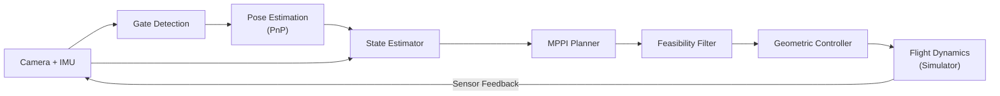
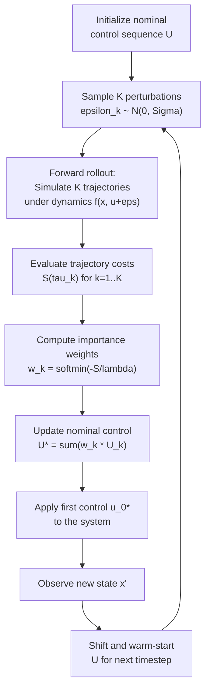
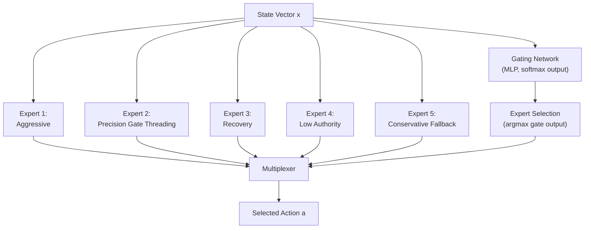
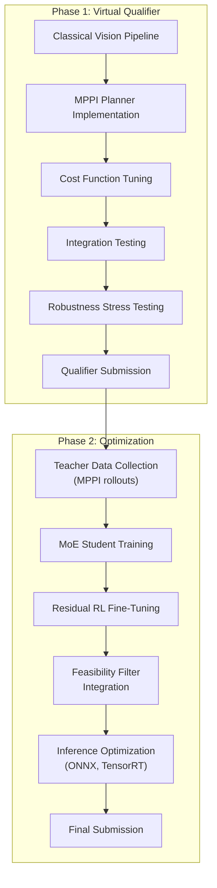

# Autonomous Drone Racing for the AI Grand Prix

**Technical Strategy & Architecture Proposal**

---

## Abstract

Autonomous drone racing demands the tight integration of perception, state estimation, planning, and control under aggressive flight dynamics and strict actuation constraints. We present a modular autonomy architecture for the AI Grand Prix that combines classical computer vision for gate detection, Model Predictive Path Integral (MPPI) control for short-horizon trajectory optimization, and a suite of learning-based enhancements including teacher--student policy distillation, Mixture-of-Experts (MoE) specialization, and residual reinforcement learning. Our system is designed to maximize forward progress through a structured 3D gate course while explicitly encoding the speed--safety tradeoff in a multi-objective cost function. We argue that this hybrid approach---grounded in physics-based planning and augmented by lightweight learned components---represents the most robust and performant strategy for autonomous racing under realistic constraints.

---

## Table of Contents

1. [Introduction & Problem Statement](#1-introduction--problem-statement)
2. [Background & Related Work](#2-background--related-work)
3. [Core Technical Challenges](#3-core-technical-challenges)
4. [Baseline Architecture](#4-baseline-architecture)
5. [Proposed Improvements](#5-proposed-improvements)
6. [Evaluation Plan](#6-evaluation-plan)
7. [Development Strategy & Phased Roadmap](#7-development-strategy--phased-roadmap)
8. [Conclusion](#8-conclusion)
9. [References](#9-references)

---

## 1. Introduction & Problem Statement

### 1.1 Task Definition

We address the problem of developing a **fully autonomous drone control system** capable of navigating a structured three-dimensional racecourse. The course consists of a sequence of standardized gates that must be traversed in a prescribed order. The drone receives onboard sensor data---including camera imagery and inertial measurements---and must produce low-level control commands without any human intervention.

### 1.2 Environment & Constraints

The competition environment imposes several critical constraints:

- **Simulation platform.** All runs execute inside the DCL (Drone Champions League) simulation engine on a Windows-based host. The autonomy stack interfaces with the simulator via a Python API.
- **Standardized gates.** Gates have known geometry and visual appearance, simplifying perception but demanding precise localization for safe traversal at high speed.
- **Realistic flight dynamics.** The simulator models aerodynamic effects, actuator latency, thrust limits, and rotational inertia. Control solutions must respect these physical realities.
- **Python-based stack.** All autonomy logic---perception, planning, control---must be implemented in Python (with permissible compiled extensions for performance-critical components).

### 1.3 Evaluation Criteria

Performance is evaluated along three axes, in decreasing priority:

| Priority | Criterion | Description |
|----------|-----------|-------------|
| Primary | **Lap time** | Fastest valid completion of all gates in order |
| Secondary | **Validity** | Correct gate traversal sequence, no crashes, stable flight |
| Tertiary | **Robustness** | Consistent performance across runs under minor perturbation |

### 1.4 Why This Problem Is Hard

The fundamental difficulty arises from the **tight coupling** of five subsystems---perception, state estimation, planning, control, and safety management---all operating under aggressive dynamics with hard actuation limits. A solution that excels at planning but ignores actuator saturation will crash. A solution that prioritizes safety will be too slow. The winning system must navigate this tradeoff explicitly and optimally.

---

## 2. Background & Related Work

### 2.1 Autonomous Drone Racing in the Literature

Autonomous drone racing has emerged as a benchmark problem at the intersection of robotics, computer vision, and optimal control. Several landmark efforts inform our approach:

- **DARPA AlphaPilot (2019--2021).** The first large-scale autonomous drone racing competition. Winning teams employed classical perception pipelines with model predictive control, validating the viability of modular architectures over end-to-end learning [1].
- **ETH Zurich Aggressive Quadrotor Research.** Extensive work on agile flight, time-optimal trajectory generation, and perception-aware planning. Notably, Kaufmann et al. demonstrated deep learning for drone racing with sim-to-real transfer [2].
- **UPenn GRASP Lab.** Pioneering work on geometric control for quadrotors, minimum-snap trajectory generation, and aggressive maneuvers through narrow gaps [3].
- **MPPI for Robotic Control.** Williams et al. introduced Model Predictive Path Integral control as a sampling-based alternative to gradient-based MPC, enabling real-time optimization over nonlinear dynamics without requiring differentiability [4].
- **Vision-Based Agile Flight.** Loquercio et al. demonstrated that learned perception combined with classical control can achieve robust agile flight in unstructured environments [5].

### 2.2 Common Architectural Pattern

High-performing autonomous racing systems converge on a common pipeline:

$$
\text{Perception} \;\rightarrow\; \text{State Estimation} \;\rightarrow\; \text{Short-Horizon Optimal Control} \;\rightarrow\; \text{Geometric Tracking}
$$

Learning is typically employed for specific subproblems---perception, value function approximation, planner distillation, or residual corrections---rather than as a monolithic end-to-end policy. Pure end-to-end reinforcement learning from pixels has not yet demonstrated competitive performance in real-world or high-fidelity racing scenarios, due to sample complexity, sim-to-real gaps, and lack of constraint awareness.

### 2.3 Positioning Our Approach

We adopt and extend this established pattern. Our baseline uses sampling-based optimal control (MPPI) with a carefully designed multi-objective cost function. We then propose a progression of learning-based enhancements---distillation, specialization, and residual RL---that preserve the interpretability and constraint-awareness of the classical core while improving speed, adaptability, and robustness.

---

## 3. Core Technical Challenges

The autonomous racing problem decomposes into five tightly coupled subproblems. We describe each here in terms of its technical requirements; solutions are presented in Sections 4 and 5.

### 3.1 Perception: Gate Recognition & Localization

The system must detect gates from onboard camera imagery and estimate their 6-DoF pose relative to the drone. Key difficulties include partial visibility (when approaching at oblique angles or high speed), motion blur during aggressive maneuvers, and the need for sub-gate-width localization accuracy to enable safe high-speed traversal. The standardized gate geometry is a significant simplification, but robust localization remains critical.

### 3.2 State Estimation

Accurate knowledge of the drone's full kinematic state---position, velocity, orientation, and angular rates---is a prerequisite for effective planning and control. The state estimator must fuse heterogeneous sensor modalities (IMU, simulator-provided state, vision-derived landmarks) and maintain accuracy under aggressive dynamics where linearization assumptions may break down.

### 3.3 Planning Under Dynamics

The planner must compute control sequences that maximize forward progress through the gate course while respecting actuation limits, avoiding gate collisions, and remaining dynamically feasible. Formally, this is a **constrained nonlinear optimal control problem** with a receding horizon. The challenge is solving it in real time at control rates of 50--100 Hz.

### 3.4 Control Execution

The controller must translate planned trajectories or acceleration commands into feasible rotor-level inputs. It must handle actuator saturation gracefully---avoiding the instability that arises when commanded thrusts exceed physical limits---and maintain smooth, trackable commands even when the planner requests aggressive maneuvers.

### 3.5 The Speed--Safety Tradeoff

This is the meta-challenge that pervades the entire system. Faster flight increases gate-clipping probability, amplifies the consequences of estimation errors, and pushes actuators closer to saturation. The system must encode this tradeoff explicitly rather than relying on ad hoc safety margins. Our cost function (Section 4.5) and multi-expert architecture (Section 5.2) are designed specifically to address this.

---

## 4. Baseline Architecture

### 4.1 System Pipeline

The baseline architecture follows a modular pipeline from raw sensor input to actuator commands:

**Figure 1.** End-to-end system pipeline. Sensor data flows left to right through perception, estimation, planning, and control stages. The simulator closes the loop by providing sensor feedback at each timestep.

Each module operates at a fixed rate: perception at 30 Hz (camera frame rate), state estimation at 100 Hz (IMU rate), and planning/control at 50 Hz. The feasibility filter between the planner and controller rejects commands that would cause actuator saturation or violate attitude constraints.

### 4.2 Perception Baseline

Given the standardized gate geometry and structured environment, we adopt a classical perception pipeline that avoids the latency and complexity of deep neural networks:

1. **Color segmentation.** Convert camera frames to HSV color space and threshold on the known gate color to produce a binary mask.
2. **Contour extraction.** Apply morphological operations (erosion, dilation) to clean the mask, then extract contours using the Suzuki--Abe algorithm.
3. **Rectangle fitting.** Fit minimum-area rectangles to candidate contours. Filter by aspect ratio, area, and convexity to reject false positives.
4. **Corner detection.** Extract the four corners of the best-fit rectangle as 2D image landmarks.
5. **Pose estimation via PnP.** Given the known 3D gate geometry and the detected 2D corners, solve the Perspective-n-Point problem to recover the gate's 6-DoF pose relative to the camera:

$$
\hat{T}_{cg} = \text{PnP}(\{p_i^{2D}\}_{i=1}^{4}, \{P_i^{3D}\}_{i=1}^{4}, K)
$$

where $K$ is the camera intrinsic matrix, $p_i^{2D}$ are the detected corners, and $P_i^{3D}$ are the known gate corner positions.

**Fallback.** If classical detection proves insufficiently robust (e.g., under motion blur or partial occlusion), we maintain a fallback path using a lightweight CNN (MobileNet-v3-Small backbone) for bounding box and corner regression, followed by the same PnP solver.

### 4.3 State Representation

The full state vector $\mathbf{x} \in \mathbb{R}^{n}$ is defined as:

| Component | Symbol | Dimension | Description |
|-----------|--------|-----------|-------------|
| Position | $\mathbf{p}$ | $\mathbb{R}^3$ | World-frame position $(x, y, z)$ |
| Velocity | $\mathbf{v}$ | $\mathbb{R}^3$ | World-frame linear velocity $(v_x, v_y, v_z)$ |
| Attitude | $\mathbf{q}$ | $\mathbb{S}^3$ | Unit quaternion $(q_w, q_x, q_y, q_z)$ |
| Angular rates | $\boldsymbol{\omega}$ | $\mathbb{R}^3$ | Body-frame angular velocity $(p, q, r)$ |
| Relative gate pose | $\mathbf{g}_{\text{rel}}$ | $\mathbb{R}^6$ | Position and orientation of the next gate in body frame |
| Progress scalar | $s$ | $\mathbb{R}$ | Normalized progress along the course $[0, 1]$ |

The control input $\mathbf{u} \in \mathbb{R}^4$ represents collective thrust and body-frame torques (or equivalently, four individual rotor thrusts).

### 4.4 MPPI Planner

We employ **Model Predictive Path Integral (MPPI) control** [4] as our primary planning algorithm. MPPI is a sampling-based stochastic optimal control method that solves finite-horizon optimization problems over nonlinear dynamics without requiring gradient computation.

#### 4.4.1 Problem Formulation

Given current state $\mathbf{x}_0$, we seek the optimal control sequence $\mathbf{U}^* = (\mathbf{u}_0^*, \mathbf{u}_1^*, \ldots, \mathbf{u}_{H-1}^*)$ over a planning horizon $H$ that minimizes the expected trajectory cost:

$$
\mathbf{U}^* = \arg\min_{\mathbf{U}} \; \mathbb{E}_{\boldsymbol{\epsilon} \sim \mathcal{N}(0, \Sigma)} \left[ S(\tau) \right]
$$

where $\tau = (\mathbf{x}_0, \mathbf{u}_0, \mathbf{x}_1, \mathbf{u}_1, \ldots, \mathbf{x}_H)$ is the state-control trajectory obtained by forward-simulating the dynamics $\mathbf{x}_{t+1} = f(\mathbf{x}_t, \mathbf{u}_t + \boldsymbol{\epsilon}_t)$, and $S(\tau)$ is the cumulative cost (defined in Section 4.5).

#### 4.4.2 Importance-Weighted Update

MPPI converts the optimization into an importance-sampling problem. Given $K$ sampled control sequences $\{\mathbf{U}_k\}_{k=1}^{K}$, each producing trajectory $\tau_k$ with cost $S(\tau_k)$, the optimal control is approximated by the weighted average:

$$
\mathbf{U}^* \approx \sum_{k=1}^{K} w_k \, \mathbf{U}_k
$$

where the importance weights are computed via the softmin:

$$
w_k = \frac{\exp\!\left(-\frac{1}{\lambda} S(\tau_k)\right)}{\sum_{j=1}^{K} \exp\!\left(-\frac{1}{\lambda} S(\tau_j)\right)}
$$

The temperature parameter $\lambda > 0$ controls the sharpness of the weighting: smaller $\lambda$ concentrates weight on lower-cost trajectories (exploitation), while larger $\lambda$ maintains diversity (exploration).

#### 4.4.3 Receding-Horizon Execution

MPPI operates in a receding-horizon fashion: at each control timestep, we solve the $H$-step optimization, apply only the first control $\mathbf{u}_0^*$, observe the resulting state, and re-plan. The previous solution is warm-started by shifting the control sequence forward in time and appending a default control at the end.

**Figure 2.** MPPI receding-horizon control loop. At each timestep, $K$ stochastic rollouts are evaluated, weighted by cost, and aggregated to produce the optimal control. Only the first action is executed before re-planning.

#### 4.4.4 Hyperparameters

Key MPPI hyperparameters and their roles:

| Parameter | Symbol | Typical Range | Role |
|-----------|--------|---------------|------|
| Number of samples | $K$ | 256--2048 | Trajectory coverage; higher is better but more expensive |
| Planning horizon | $H$ | 20--50 steps | Lookahead depth; must cover at least one gate transition |
| Temperature | $\lambda$ | 0.01--1.0 | Exploration--exploitation tradeoff |
| Noise covariance | $\Sigma$ | Diagonal, tuned | Sampling spread; controls aggressiveness of exploration |
| Control rate | -- | 50 Hz | Replanning frequency |

### 4.5 Cost Function

The trajectory cost $S(\tau)$ is the core mechanism by which we encode the speed--safety tradeoff. It is defined as a weighted sum of seven terms evaluated at each timestep along the planning horizon:

$$
S(\tau) = \sum_{t=0}^{H} \left[ \mathcal{L}_{\text{progress}}(\mathbf{x}_t) + \mathcal{L}_{\text{gate}}(\mathbf{x}_t) + \mathcal{L}_{\text{clearance}}(\mathbf{x}_t) + \mathcal{L}_{\text{sat}}(\mathbf{u}_t) + \mathcal{L}_{\text{smooth}}(\mathbf{u}_t, \mathbf{u}_{t-1}) + \mathcal{L}_{\text{tilt}}(\mathbf{x}_t) + \mathcal{L}_{\text{crash}}(\mathbf{x}_t) \right]
$$

Each term is detailed below.

#### 4.5.1 Progress Term (Speed Maximization)

We reward forward progress along the direction toward the next gate. Let $\hat{\mathbf{n}}_g$ be the unit normal of the target gate plane and $\Delta \mathbf{p}_t$ be the displacement from timestep $t-1$ to $t$. The progress cost is:

$$
\mathcal{L}_{\text{progress}}(\mathbf{x}_t) = -w_p \; \Delta \mathbf{p}_t \cdot \hat{\mathbf{n}}_g
$$

This is negative (a reward) when the drone moves toward the gate, encouraging speed.

#### 4.5.2 Gate Alignment

Penalizes lateral and vertical deviation from the gate center. Let $\mathbf{d}_t$ be the displacement from the drone to the gate center projected onto the gate plane:

$$
\mathcal{L}_{\text{gate}}(\mathbf{x}_t) = w_g \; \|\mathbf{d}_t^{\perp}\|^2
$$

where $\mathbf{d}_t^{\perp}$ is the component of $\mathbf{d}_t$ perpendicular to the gate normal.

#### 4.5.3 Gate Clearance Margin

Encourages the drone to pass through the gate with sufficient margin from the frame. Let $d_{\text{frame}}$ be the distance from the drone's projected position to the nearest gate edge, and $r_{\text{gate}}$ the gate half-width:

$$
\mathcal{L}_{\text{clearance}}(\mathbf{x}_t) = w_c \; \max\!\left(0, \; d_{\text{frame}} - (r_{\text{gate}} - m_{\text{clear}})\right)^2
$$

where $m_{\text{clear}}$ is the desired minimum clearance margin.

#### 4.5.4 Actuator Saturation Penalty

Discourages commands that approach or exceed actuator limits. Let $u_{\text{norm}} = \|\mathbf{u}_t\| / u_{\max}$ be the normalized control magnitude:

$$
\mathcal{L}_{\text{sat}}(\mathbf{u}_t) = w_s \; \max\!\left(0, \; u_{\text{norm}} - m_{\text{sat}}\right)^2
$$

where $m_{\text{sat}} \in (0, 1)$ is the saturation margin (e.g., 0.85). This creates a soft boundary that penalizes operation above 85% of maximum thrust, discouraging sustained saturation without hard-clipping the planner's solution space.

#### 4.5.5 Smoothness (Jerk Penalty)

Penalizes abrupt changes in control input to promote trackable, smooth trajectories:

$$
\mathcal{L}_{\text{smooth}}(\mathbf{u}_t, \mathbf{u}_{t-1}) = w_j \; \|\mathbf{u}_t - \mathbf{u}_{t-1}\|^2
$$

#### 4.5.6 Attitude Limit Penalty

Penalizes excessive tilt angles that could lead to loss of control authority or instability. Let $\theta_{\text{tilt}}$ be the angle between the drone's body z-axis and the world vertical:

$$
\mathcal{L}_{\text{tilt}}(\mathbf{x}_t) = w_t \; \max\!\left(0, \; \theta_{\text{tilt}} - \theta_{\max}\right)^2
$$

#### 4.5.7 Crash / Violation Penalty

A large constant penalty applied when the trajectory enters a terminal failure state (collision with gate frame, ground contact, or flight boundary violation):

$$
\mathcal{L}_{\text{crash}}(\mathbf{x}_t) = 
\begin{cases}
C_{\text{crash}} & \text{if } \mathbf{x}_t \in \mathcal{X}_{\text{fail}} \\
0 & \text{otherwise}
\end{cases}
$$

where $C_{\text{crash}} \gg 1$ is set large enough to dominate all other cost terms.

#### 4.5.8 Combined Cost Summary

The full cost function with default weight ordering:

$$
S(\tau) = \sum_{t=0}^{H} \Big[ \underbrace{-w_p \, \Delta\mathbf{p}_t \cdot \hat{\mathbf{n}}_g}_{\text{progress}} + \underbrace{w_g \|\mathbf{d}_t^{\perp}\|^2}_{\text{alignment}} + \underbrace{w_c \, [\cdot]^2_+}_{\text{clearance}} + \underbrace{w_s \, [\cdot]^2_+}_{\text{saturation}} + \underbrace{w_j \|\Delta\mathbf{u}_t\|^2}_{\text{smoothness}} + \underbrace{w_t \, [\cdot]^2_+}_{\text{tilt}} + \underbrace{\mathcal{L}_{\text{crash}}}_{\text{crash}} \Big]
$$

where $[\cdot]_+ = \max(0, \cdot)$ denotes the positive part. The weights $(w_p, w_g, w_c, w_s, w_j, w_t)$ are the primary tuning knobs that encode the speed--safety tradeoff.

---

## 5. Proposed Improvements

The baseline MPPI architecture provides a solid foundation, but several enhancements can significantly improve lap time, robustness, and adaptability. We propose four improvements, each building on the previous.

### 5.1 Teacher--Student Policy Distillation

#### Motivation

MPPI is computationally expensive at inference time: each control step requires $K$ forward rollouts of the dynamics model over horizon $H$. For $K = 1024$ and $H = 30$, this is approximately 30,000 dynamics evaluations per control step. While feasible on modern hardware, this limits the budget available for other components and constrains the control rate.

#### Approach

We treat the tuned MPPI planner as a **teacher** and train a lightweight neural network **student** to approximate its behavior:

1. **Data generation.** Run the MPPI planner across diverse initial conditions, gate configurations, and flight regimes. Record state--action pairs $\{(\mathbf{x}_i, \mathbf{u}_i^{\text{MPPI}})\}_{i=1}^{N}$.
2. **Student architecture.** A multi-layer perceptron (MLP) with 2--3 hidden layers of 128 units each, using ReLU activations and layer normalization.
3. **Input.** State vector $\mathbf{x}$ including relative gate pose and progress scalar.
4. **Output.** Desired acceleration vector $\mathbf{a} \in \mathbb{R}^3$ and yaw rate $\dot{\psi} \in \mathbb{R}$.

#### Training Objective

The student is trained with a composite loss:

$$
\mathcal{L}_{\text{student}} = \underbrace{\mathcal{H}_\delta(\mathbf{a}_{\text{student}} - \mathbf{a}_{\text{teacher}})}_{\text{Huber imitation loss}} + \underbrace{w_s^{\prime} \, \mathcal{L}_{\text{sat}}(\mathbf{a}_{\text{student}})}_{\text{saturation regularizer}} + \underbrace{w_j^{\prime} \, \|\Delta\mathbf{a}\|^2}_{\text{smoothness}} + \underbrace{w_g^{\prime} \, \|\mathbf{d}^{\perp}\|^2}_{\text{gate alignment}}
$$

where $\mathcal{H}_\delta$ is the Huber loss with threshold $\delta$, providing robustness to outlier teacher actions:

$$
\mathcal{H}_\delta(e) = 
\begin{cases}
\frac{1}{2} e^2 & \text{if } |e| \leq \delta \\
\delta(|e| - \frac{1}{2}\delta) & \text{otherwise}
\end{cases}
$$

The auxiliary loss terms ensure the student inherits the constraint-awareness of the teacher's cost function, not just its input--output mapping.

### 5.2 Mixture-of-Experts (MoE)

#### Motivation

A single MLP student must compress the entire flight regime---from aggressive straight-line acceleration to delicate gate threading to emergency recovery---into one set of weights. This is suboptimal: the optimal control strategy differs qualitatively across regimes.

#### Architecture

We replace the single student head with $K$ specialized **expert heads**, each an MLP producing an action, and a **gating network** that selects the active expert based on the current state:

**Figure 3.** Mixture-of-Experts architecture. The gating network routes each state to the most appropriate expert. At inference time, only the selected expert computes the action, maintaining low latency.

#### Expert Specialization

| Expert | Regime | Behavior |
|--------|--------|----------|
| Aggressive | High-speed straightaways | Maximum thrust, minimal smoothness penalty |
| Precision | Gate approach and traversal | Tight alignment, conservative actuator use |
| Recovery | Post-disturbance or near-crash | Stabilization priority, altitude recovery |
| Low authority | Near actuator limits | Graceful degradation under saturation |
| Conservative | Uncertain perception | Reduced speed, increased safety margins |

#### Training

Expert assignment is determined by the teacher data. For each state $\mathbf{x}_i$, the best-performing teacher rollout is identified and assigned to the corresponding expert. Training uses a joint loss:

$$
\mathcal{L}_{\text{MoE}} = \underbrace{\mathcal{L}_{\text{CE}}(g(\mathbf{x}), k^*)}_{\text{gating cross-entropy}} + \underbrace{\mathcal{H}_\delta(\mathbf{a}_{k^*}(\mathbf{x}) - \mathbf{a}_{\text{teacher}})}_{\text{expert imitation}} + \underbrace{w_{\text{switch}} \sum_t \mathbb{1}[k_t \neq k_{t-1}]}_{\text{switching penalty}}
$$

where $k^*$ is the ground-truth expert label and $g(\mathbf{x})$ is the gating network's output distribution. The switching penalty discourages rapid oscillation between experts (jitter).

### 5.3 Residual Reinforcement Learning

#### Motivation

Distillation preserves the teacher's behavior but cannot exceed it. The teacher (MPPI) itself is limited by its dynamics model fidelity, cost function design, and finite sampling budget. Residual RL provides a mechanism to fine-tune the student beyond the teacher's performance envelope.

#### Formulation

The final control output is the sum of the student's action and a learned residual correction:

$$
\mathbf{a} = \mathbf{a}_{\text{student}}(\mathbf{x}) + \Delta\mathbf{a}_{\text{RL}}(\mathbf{x})
$$

The residual $\Delta\mathbf{a}_{\text{RL}}$ is trained via proximal policy optimization (PPO) or soft actor-critic (SAC) with the following reward function:

$$
r_t = \underbrace{\alpha \, \Delta s_t}_{\text{progress}} - \underbrace{\beta \, \mathbb{1}[\text{crash}]}_{\text{crash penalty}} - \underbrace{\gamma \, \mathbb{1}[\text{gate miss}]}_{\text{gate miss}} - \underbrace{\eta \, \mathcal{L}_{\text{sat}}(\mathbf{u}_t)}_{\text{saturation}} - \underbrace{\xi \, \|\Delta\mathbf{u}_t\|^2}_{\text{smoothness}}
$$

where $\Delta s_t$ is the incremental progress along the course.

#### What RL Improves

Residual RL is specifically targeted at regimes where the teacher is weakest:

- **Stability near actuator limits.** The RL agent learns subtle corrections that prevent saturation-induced oscillations.
- **Recovery from disturbances.** Aggressive maneuvers that the conservative MPPI cost function avoids.
- **Robustness under model mismatch.** The RL agent adapts to dynamics that differ from the MPPI rollout model.

We emphasize that RL is used as a **fine-tuning mechanism on top of a strong prior**, not as a training-from-scratch method. This dramatically reduces sample complexity and avoids the catastrophic failure modes of tabula rasa RL in safety-critical settings.

### 5.4 Robustness Training via Domain Randomization

To ensure the learned components generalize across the range of conditions encountered in competition, we apply domain randomization during both distillation and RL training:

| Randomization | Range | Purpose |
|---------------|-------|---------|
| Actuator lag | 0--30 ms | Model response delay |
| Thrust scaling | 0.85--1.15x | Calibration uncertainty |
| Battery voltage sag | 0--15% reduction | Endurance effects |
| IMU noise | $\sigma \in [0, 0.05]$ rad/s | Sensor degradation |
| Drag coefficient | 0.8--1.2x | Aerodynamic uncertainty |
| Gate position jitter | $\pm 5$ cm | Localization error |

Training explicitly includes states near the actuation boundary to ensure the policy learns graceful degradation rather than catastrophic failure when approaching physical limits.

---

## 6. Evaluation Plan

### 6.1 Performance Metrics

We define five quantitative metrics to evaluate system performance:

| Metric | Symbol | Unit | Target |
|--------|--------|------|--------|
| Lap time | $T_{\text{lap}}$ | seconds | Minimize |
| Gate pass rate | $R_{\text{gate}}$ | % | > 99% |
| Crash rate | $R_{\text{crash}}$ | % | < 1% |
| Actuator saturation fraction | $\bar{u}_{\text{sat}}$ | % of timesteps | < 15% |
| Trajectory smoothness | $J_{\text{jerk}}$ | $\int \|\dddot{\mathbf{p}}\|^2 \, dt$ | Minimize |

### 6.2 Ablation Study Design

To isolate the contribution of each architectural component, we define a structured ablation study:

| Configuration | Perception | Planner | Policy | RL | Robustness |
|---------------|------------|---------|--------|----|------------|
| **A: PID Baseline** | Classical | Waypoint + PID | -- | -- | -- |
| **B: MPPI Baseline** | Classical | MPPI | -- | -- | -- |
| **C: Distilled Student** | Classical | -- | MLP Student | -- | -- |
| **D: MoE Student** | Classical | -- | MoE Student | -- | -- |
| **E: MoE + Residual RL** | Classical | -- | MoE Student | PPO | -- |
| **F: Full System** | Classical | -- | MoE Student | PPO | Domain Rand. |

Each configuration is evaluated over 50 runs on 3 distinct track layouts. We report mean and standard deviation for all five metrics.

### 6.3 Stress Testing Protocol

Beyond nominal performance, we evaluate robustness under controlled perturbations:

- **Wind perturbation sweep.** Apply constant and stochastic wind forces at 0, 2, 4, 6, 8 m/s. Measure lap time degradation and crash rate.
- **Sensor noise scaling.** Multiply IMU noise by factors of 1x, 2x, 4x, 8x. Measure gate pass rate and trajectory smoothness degradation.
- **Actuator delay sweep.** Introduce artificial actuator delays of 0, 10, 20, 30, 50 ms. Identify the failure threshold for each configuration.
- **Gate position perturbation.** Add Gaussian noise ($\sigma$ = 5, 10, 20 cm) to gate positions. Measure robustness of perception and planning.

### 6.4 Baseline Comparisons

We compare against two reference implementations:

1. **PID waypoint follower.** A simple controller that tracks a sequence of waypoints at gate centers using cascaded PID loops (position -> velocity -> attitude -> rate). This represents the minimal viable solution.
2. **End-to-end RL.** A PPO agent trained from state observations (no vision) with a dense reward function. This represents the pure learning baseline, highlighting the advantages of our hybrid approach.

---

## 7. Development Strategy & Phased Roadmap

We organize development into two phases, aligned with competition milestones.

**Figure 4.** Two-phase development roadmap. Phase 1 delivers a competition-ready MPPI baseline. Phase 2 introduces learning-based enhancements for improved speed and robustness.

### Phase 1: Virtual Qualifier

**Objective:** Deliver a reliable, competition-ready system using the MPPI baseline.

| Task | Deliverable | Success Criterion |
|------|-------------|-------------------|
| Perception pipeline | Gate detection + PnP pose | > 95% detection rate at 30 Hz |
| MPPI implementation | Functional planner | Real-time at 50 Hz with K=512 |
| Cost function tuning | Calibrated weights | Sub-crash lap completion on 3 tracks |
| Integration testing | Full pipeline end-to-end | 10 consecutive clean laps |
| Robustness testing | Stress test report | < 5% crash rate under moderate perturbation |

### Phase 2: Optimization

**Objective:** Push lap time toward the theoretical minimum while maintaining robustness.

| Task | Deliverable | Success Criterion |
|------|-------------|-------------------|
| Teacher data collection | 100k+ state-action pairs | Coverage of all flight regimes |
| MoE student training | Trained MoE policy | Matches MPPI lap time within 5% |
| Residual RL | Fine-tuned MoE + RL | Beats MPPI lap time by > 10% |
| Feasibility filter | Constraint enforcement layer | Zero actuator-saturation crashes |
| Inference optimization | ONNX/compiled model | < 2 ms inference latency |

---

## 8. Conclusion

We have presented a comprehensive architecture for autonomous drone racing in the AI Grand Prix, grounded in the established paradigm of modular perception--planning--control with targeted learning-based enhancements. Our approach is distinguished by several key design decisions:

1. **Explicit constraint encoding.** The multi-term cost function directly encodes the speed--safety tradeoff rather than relying on implicit learning or ad hoc margins.
2. **Sampling-based optimization.** MPPI provides real-time optimal control over nonlinear dynamics without requiring differentiable models or convex approximations.
3. **Progressive learning.** Teacher--student distillation, expert specialization, and residual RL each build incrementally on the previous layer, preserving the constraint-awareness of the classical core.
4. **Robustness by design.** Domain randomization during training and stress testing during evaluation ensure the system performs reliably under the conditions that matter.

This architecture reflects the state of the art in autonomous racing: not massive end-to-end models, but the disciplined combination of physics-based reasoning and lightweight learning, each applied where it provides the greatest leverage.

---

## 9. References

[1] Foehn, P., Bösiger, E., Kaufmann, E., Cieslewski, T., Gehrig, M., Muglikar, M., & Scaramuzza, D. (2022). AlphaPilot: Autonomous drone racing. *Autonomous Robots*, 46(1), 307--320.

[2] Kaufmann, E., Loquercio, A., Ranftl, R., Müller, M., Koltun, V., & Scaramuzza, D. (2020). Deep drone racing: From simulation to reality with domain randomization. *IEEE Transactions on Robotics*, 36(1), 1--14.

[3] Mellinger, D., & Kumar, V. (2011). Minimum snap trajectory generation and control for quadrotors. *Proceedings of the IEEE International Conference on Robotics and Automation (ICRA)*, 2521--2526.

[4] Williams, G., Aldrich, A., & Theodorou, E. A. (2017). Model predictive path integral control: From theory to parallel computation. *Journal of Guidance, Control, and Dynamics*, 40(2), 344--357.

[5] Loquercio, A., Kaufmann, E., Ranftl, R., Dosovitskiy, A., Koltun, V., & Scaramuzza, D. (2019). Deep drone acrobatics. *RSS 2020*.

[6] Lee, T., Leok, M., & McClamroch, N. H. (2010). Geometric tracking control of a quadrotor UAV on SE(3). *Proceedings of the IEEE Conference on Decision and Control (CDC)*, 5420--5425.

[7] Schulman, J., Wolski, F., Dhariwal, P., Radford, A., & Klimov, O. (2017). Proximal policy optimization algorithms. *arXiv preprint arXiv:1707.06347*.

[8] Shao, J., Jiang, Y., & Scaramuzza, D. (2023). Mixture-of-experts for agile quadrotor control. *arXiv preprint*.
