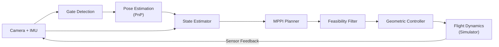
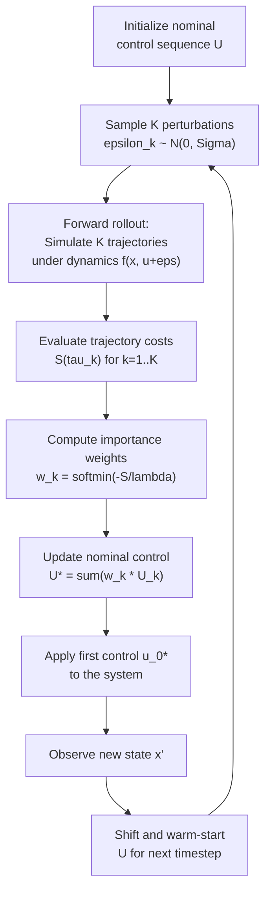
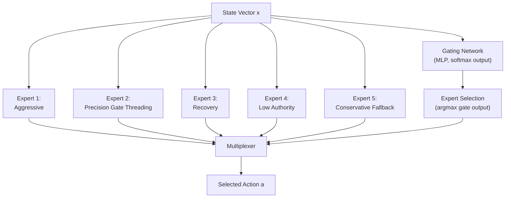
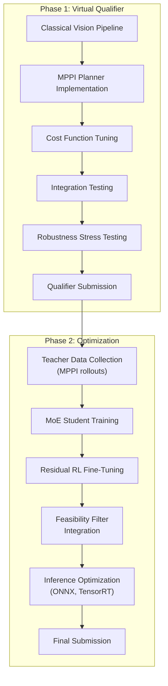

# Autonomous Drone Racing for the AI Grand Prix

**Technical Strategy & Architecture Proposal**

---

## Abstract

Autonomous drone racing demands the tight integration of perception, state estimation, planning, and control under aggressive flight dynamics and strict actuation constraints. We present a modular autonomy architecture for the AI Grand Prix that combines classical computer vision for gate detection, Model Predictive Path Integral (MPPI) control for short-horizon trajectory optimization, and a suite of learning-based enhancements including teacher--student policy distillation, Mixture-of-Experts (MoE) specialization, and residual reinforcement learning. Our system is designed to maximize forward progress through a structured 3D gate course while explicitly encoding the speed--safety tradeoff in a multi-objective cost function. We argue that this hybrid approach---grounded in physics-based planning and augmented by lightweight learned components---represents the most robust and performant strategy for autonomous racing under realistic constraints.

---

## Table of Contents

1. [Introduction & Problem Statement](#1-introduction--problem-statement)
2. [Related Work](#2-related-work)
3. [Core Technical Challenges](#3-core-technical-challenges)
4. [Baseline Architecture](#4-baseline-architecture)
5. [Proposed Improvements](#5-proposed-improvements)
6. [Evaluation Plan](#6-evaluation-plan)
7. [Development Strategy & Phased Roadmap](#7-development-strategy--phased-roadmap)
8. [Conclusion](#8-conclusion)
9. [References](#9-references)

---

## 1. Introduction & Problem Statement

### 1.1 Task Definition

We address the problem of developing a **fully autonomous drone control system** capable of navigating a structured three-dimensional racecourse. The course consists of a sequence of standardized gates that must be traversed in a prescribed order. The drone receives onboard sensor data---including camera imagery and inertial measurements---and must produce low-level control commands without any human intervention.

### 1.2 Competition Structure

The AI Grand Prix, operated by the Drone Champions League (DCL) in partnership with Anduril Industries, follows a phased format:

| Phase | Timeline | Format |
|-------|----------|--------|
| Virtual Qualifiers | April--June 2026 | Teams submit Python-based AI algorithms into a DCL-built simulation platform |
| Physical Qualifier | September 2026 | In-person training and qualification on standardized hardware (California) |
| Finals | November 2026 | Championship event (Ohio) |

In physical stages, all teams fly identical drones built by Neros Technologies with no hardware modifications permitted; code quality is the sole differentiator. The platform integrates DCL's "AI vector module," but technical specifications for the standardized UAS---including onboard compute, camera model, and IMU grade---have not yet been released. This uncertainty motivates a **portability-first** design: our autonomy stack targets Jetson-class embedded constraints as a conservative design envelope, even though the virtual phase runs on desktop hardware (described as requiring "a mid-tier PC with a dedicated GPU"). Final hardware targets will be revised when specifications are published.

### 1.3 Environment & Constraints

The competition environment imposes several critical constraints:

- **Simulation platform.** Virtual qualifiers execute inside the DCL simulation engine. The autonomy stack interfaces with the simulator via a Python API, receiving visual and sensor data under realistic physics.
- **Standardized gates.** Gates have known geometry and visual appearance, simplifying perception but demanding precise localization for safe traversal at high speed.
- **Realistic flight dynamics.** The simulator models aerodynamic effects, actuator latency, thrust limits, and rotational inertia. Control solutions must respect these physical realities.
- **Python-based stack.** All autonomy logic---perception, planning, control---must be implemented in Python (with permissible compiled extensions for performance-critical components).
- **Unknown final hardware.** The exact I/O API (observation structure, action interface, timing model) for the virtual platform, and the onboard compute and sensor suite for physical stages, remain unspecified. The stack must handle both vectorized-state-plus-image and image-plus-IMU observation modalities.

### 1.4 Evaluation Criteria

Performance is evaluated along three axes, in decreasing priority:

| Priority | Criterion | Description |
|----------|-----------|-------------|
| Primary | **Lap time** | Fastest valid completion of all gates in order |
| Secondary | **Validity** | Correct gate traversal sequence, no crashes, stable flight |
| Tertiary | **Robustness** | Consistent performance across runs under minor perturbation |

### 1.5 Why This Problem Is Hard

The fundamental difficulty arises from the **tight coupling** of five subsystems---perception, state estimation, planning, control, and safety management---all operating under aggressive dynamics with hard actuation limits. A solution that excels at planning but ignores actuator saturation will crash. A solution that prioritizes safety will be too slow. The winning system must navigate this tradeoff explicitly and optimally.

### 1.6 Known Unknowns

Several platform details remain unspecified and must be treated as open design variables until the competitor SDK and API are released. Our architecture is designed to accommodate any resolution of these unknowns without structural rework.

| Unknown | Design Impact | Our Assumption (Provisional) |
|---------|---------------|------------------------------|
| **Observation modalities** | Whether we receive vectorized state, raw images, or both; whether privileged sim state is available | Design for both: pass-through adapter if privileged state is given; full perception pipeline if not |
| **Action interface** | Whether the platform exposes rotor thrusts, (collective thrust, body rates), or (desired accel, yaw rate) | Support all three via a low-level adapter below the planner/policy |
| **Timing model** | Control frequency, observation latency, whether actions are held between steps | Architect for 50 Hz control with explicit latency compensation; adjustable on API release |
| **Reset and episode semantics** | Whether episodes reset on crash, whether partial runs score, penalty structure for gate misses | Implement flexible gate-ordering and validity logic; finalize when rules are confirmed |
| **Gate geometry specification** | Exact gate dimensions, visual appearance in sim, whether geometry is provided programmatically | Use PnP with configurable gate model; fallback to learned detection if appearance varies |
| **Onboard compute (physical stage)** | Processor, GPU, memory, power budget | Target Jetson-class constraints (expected range: 7--30 W); revise when specs are published |
| **Evaluation determinism** | Whether runs are deterministic or stochastic; whether leaderboard reflects best-of-N or single run | Optimize for robustness (low variance) alongside speed |

---

## 2. Related Work

Autonomous drone racing has matured rapidly over the past several years, producing a set of competition-proven systems and algorithm families that directly inform our design. We organize the related work into five areas: landmark racing systems, perception and state estimation, planning and control algorithms, robustness and sim-to-real transfer, and embedded execution constraints.

### 2.1 Landmark Racing Systems

Three systems stand out as the most thoroughly documented, competition-validated autonomous racing architectures. Each demonstrates a distinct design philosophy, and collectively they define the current state of the art.

**AlphaPilot** [1] is the canonical competition-deployed system from the DARPA-sponsored AlphaPilot challenge (2019--2021). Its architecture combines a learned gate detector (corner confidence maps plus Part Affinity Fields for multi-gate association), an EKF-based sensor fusion pipeline that uses gate detections to correct VIO drift, and a time-optimal planner operating at 50 Hz. AlphaPilot provides concrete embedded timing data: gate detection inference runs in 10.5 ms on a Jetson Xavier with TensorRT FP16 (3.86 GFLOPS), VIO operates at approximately 35 Hz, and the system reports approximately 130 ms of end-to-end latency compensated by forward state prediction using IMU measurements [1, 10, 11].

**Swift** [12] achieved champion-level performance against human pilots (Nature, 2023), representing the strongest demonstration of deep reinforcement learning in physical drone racing. Swift's design is explicitly modular: a corner-segmentation network produces gate poses from grayscale imagery (40 ms inference on Jetson TX2 with TensorRT FP16 at 384x384 resolution), a Kalman filter estimates translational VIO drift using gate observations, and a lightweight feedforward policy maps the resulting low-dimensional state to body rates and collective thrust (8 ms policy inference on CPU). The key to Swift's sim-to-real transfer is its use of empirical noise models estimated from real flight data to bridge sensing and dynamics discrepancies during simulation training [12, 13].

**MonoRace** [14] won the April 2025 A2RL x DCL competition using a single rolling-shutter camera and IMU---the most sensor-constrained configuration among top systems. MonoRace combines neural gate segmentation with a drone dynamics model for state estimation, adds an offline calibration refinement procedure exploiting known gate geometry, and runs a tiny guidance-and-control network at 500 Hz on the flight controller. The system reports peak speeds of 28.23 m/s (approximately 100 km/h) and emphasizes robustness to real competition failures including camera interference and IMU saturation [14, 15].

The convergent pattern across all three systems is:

$$
\text{Task-Specific Perception Abstraction} \;\rightarrow\; \text{Gate-Corrected State Estimation} \;\rightarrow\; \text{Short-Horizon Optimal Control} \;\rightarrow\; \text{Low-Level Tracking}
$$

Learning is employed for perception abstractions and (optionally) control policies, but never as a monolithic pixel-to-motor mapping. This pattern directly motivates our architecture.

### 2.2 Perception and State Estimation

#### Gate Detection Approaches

The literature presents a spectrum of gate detection methods, trading off compute cost against robustness to appearance variation:

| Approach | Compute | Robustness | Representative System |
|----------|---------|------------|----------------------|
| Classical (HSV + contour + PnP) | CPU-only, 20+ Hz on low-power hardware | Fragile under lighting/texture variation | Snake gate detection [16] |
| Tiny CNN bbox/corners + PnP | Small GPU; fits Jetson-class | Moderate; benefits from domain randomization | Deep Drone Racing [2] |
| Corner maps + PAF association | 10.5 ms on Xavier (TensorRT FP16) | Excellent; handles multi-gate ambiguity | AlphaPilot [1, 11] |
| U-Net corner segmentation | 40 ms on TX2 (TensorRT FP16) | Excellent; race-grade with drift correction | Swift [12, 13] |

The dominant lesson is that race-winning systems do not attempt general-purpose vision; they extract a task-specific, low-dimensional representation (gate corners, gate pose) that is stable, cheap, and integrates cleanly into a filter and planner [1, 12, 16]. Kaufmann et al. [2] demonstrate an influential intermediate approach where a CNN maps raw images to a robust waypoint and desired speed, while a traditional planner generates minimum-jerk trajectory segments---"learn the abstraction, not the whole controller."

#### State Estimation and Sensor Fusion

A recurring theme is that VIO drifts substantially under high-speed flight due to motion blur and aggressive maneuvers, so gates serve as landmarks to correct drift rather than expecting VIO to remain globally accurate [1, 12, 17].

Three VIO backbones appear most frequently in the racing literature: **ROVIO** (direct EKF-based, robust to feature-poor environments) [18], **VINS-Mono** (tightly coupled optimization-based, with robust initialization and failure recovery) [19], and **SVO** (semi-direct, designed for speed by operating on pixel intensities rather than extracted features) [20]. The design decision in a racing context is not which VIO is best in isolation, but what minimal ego-motion backbone is sufficient between gate updates, given that gate-derived corrections will stabilize drift.

**Latency compensation** is critical. AlphaPilot explicitly reports that its 130 ms system latency must be compensated by predicting the state estimate forward using IMU measurements to maintain high control bandwidth [10]. Swift addresses a similar problem through its drift-state Kalman filter that estimates and subtracts translational drift velocity from VIO estimates [12, 13]. A recent A2RL x DCL competition system further introduces perception-aware planning that balances speed with keeping gates visible---a practical reminder that perception and planning cannot be separated naively when gates must remain in the field of view for reliable detection [15].

### 2.3 Planning and Control Algorithms

The planning and control problem in drone racing---minimum time subject to gate traversal, actuation limits, and dynamic feasibility---has been addressed by several algorithm families.

**Minimum-snap trajectory generation** [3] remains a strong baseline. It is computationally lightweight (closed-form solves), produces smooth trajectories, and pairs well with geometric tracking controllers [6]. However, strict minimum-time traversal with constraints typically requires online time allocation or contouring objectives, so minimum-snap serves best as a fallback controller, trajectory initializer, or data generator for learning [21, 22].

**Model Predictive Contouring Control (MPCC)** [21] reframes racing as progress maximization along a reference path while minimizing contouring error, allowing the optimizer to decide timing implicitly. **MPCC++** [22] extends this with safety constraints (track boundary enforcement, terminal invariant sets), learned residual dynamics to compensate model mismatch, and automated hyperparameter tuning via TuRBO. MPCC++ reports high speed and completion reliability but requires significant solver engineering and careful handling of the mapping from MPC outputs to low-level thrust and body-rate commands.

**Model Predictive Path Integral control (MPPI)** [4] is a sampling-based alternative that handles nonconvex cost surfaces without requiring differentiability or convexity. For embedded feasibility, MPPI can exploit GPU parallelism: a Jetson Orin Nano study demonstrates GPU-parallelized MPPI meeting a 20 ms / 50 Hz constraint in trajectory tracking, while CPU-only MPPI fails the same deadline [23]. Huang et al. [9] recently demonstrated that a reference-free MPPI formulation with a gate-progress objective---closely matching our proposed cost function---achieves competitive or superior racing performance compared to trajectory-tracking baselines.

**CEM and iCEM** [24] are additional sampling-based planners. Modern variants introduce temporal correlation and memory to reduce sample count, and hybrid approaches interleave CEM with gradient descent to improve convergence [25].

**Learned policies** offer the lowest inference latency. Swift's feedforward policy runs in 8 ms [12]; MonoRace's guidance network runs at 500 Hz [14]. These are typically trained via teacher--student distillation or reinforcement learning, and represent the natural endpoint of our proposed improvement pipeline (Section 5).

### 2.4 Robustness and Sim-to-Real Transfer

Robustness in fast drone racing is not a single technique but an engineering posture: train across plausible variations, explicitly model residual mismatches, search aggressively for failures, and build fallbacks.

**Domain randomization** is the most widely used sim-to-real transfer technique, with classic origins in visual randomization (Tobin et al.) and dynamics randomization (Peng et al.) [26]. In racing, the practical randomization variables that matter most include camera exposure/blur, rolling-shutter effects, texture and lighting (perception gap), and thrust curves, drag coefficients, motor lag, battery sag, and IMU bias/noise (dynamics and sensing gap) [12, 14, 26].

**Residual dynamics models** provide an alternative to brute-force randomization. Swift attributes its successful sim-to-real transfer to empirical noise models estimated from real data [12, 13]. MPCC++ uses a complementary approach: augmenting nominal dynamics with learned residual terms while simultaneously enforcing safety constraints, addressing model mismatch while preserving constraint satisfaction structure [22].

**Robust MPC** formalizes uncertainty handling. Tube-based MPC wraps a nominal plan with an ancillary feedback controller that keeps the actual state within a disturbance-invariant tube [27]. For racing, the most valuable robust MPC contribution is bounded-uncertainty guardrails: robust gate-crossing feasibility under pose errors, robust satisfaction of actuator limits under thrust scaling uncertainty, and robustness to latency jitter through forward prediction and constraint margins.

**Adaptive Stress Testing (AST)** [28] provides a systematic approach to discovering rare but decisive failure modes. An RL agent chooses environment disturbances to reach failure states along likely trajectories, producing actionable counterexamples for system hardening. In racing, AST can uncover perception-dropout timing patterns that cause missed gates, rare IMU bias spikes that destabilize filters, and dynamics-lag combinations that cause saturation-induced gate clipping.

### 2.5 Embedded Execution Constraints

Because the AI Grand Prix drone specifications are not yet public, we anchor compute budgets on the widely used embedded platforms in the racing literature as **conservative design targets** (not confirmed hardware):

| Platform | Power Envelope | Compute | Used By | Status |
|----------|---------------|---------|---------|--------|
| Jetson TX2 | 7.5--15 W | 256 CUDA cores | Swift [12] | Reference |
| Jetson Xavier | 10--30 W | 512 CUDA cores, 2x DLA | AlphaPilot [1] | Reference |
| Jetson Orin Nano | 7--25 W | Up to 67 INT8 TOPS | MPPI feasibility studies [23] | Reference |

*Note: actual competition hardware may differ. These platforms define a plausible envelope; designs will be revised when specifications are published.*

The two most important software acceleration tools are **TensorRT** (used by both AlphaPilot and Swift for FP16/INT8 inference optimization) and **JIT compilation** (JAX XLA or Numba) for numerical kernels such as MPPI rollouts and CEM sampling. A practical rule consistent with the literature: run perception networks through TensorRT at FP16 minimum, keep the control inner loop deterministic and small, and push heavy sampling and rollout computation into compiled kernels [11, 13, 23].

### 2.6 Positioning Our Approach

We adopt and extend the convergent architectural pattern identified across AlphaPilot, Swift, and MonoRace. Our baseline uses sampling-based optimal control (MPPI) with a carefully designed multi-objective cost function that explicitly encodes the speed--safety tradeoff---an approach now independently validated by recent reference-free MPPI racing work [9]. We then propose a progression of learning-based enhancements---teacher--student distillation, MoE specialization, and residual RL---that preserve the interpretability and constraint-awareness of the classical core while improving inference speed, adaptability, and robustness. The key differentiator of our strategy is that each enhancement layer is designed to be **independently valuable and incrementally deployable**, allowing us to compete effectively in virtual qualifiers with the MPPI baseline while developing the learned components for physical-stage performance.

---

## 3. Core Technical Challenges

The autonomous racing problem decomposes into five tightly coupled subproblems. We describe each here in terms of its technical requirements; solutions are presented in Sections 4 and 5.

### 3.1 Perception: Gate Recognition & Localization

The system must detect gates from onboard camera imagery and estimate their 6-DoF pose relative to the drone. Key difficulties include partial visibility (when approaching at oblique angles or high speed), motion blur during aggressive maneuvers, and the need for sub-gate-width localization accuracy to enable safe high-speed traversal. The standardized gate geometry is a significant simplification, but robust localization remains critical.

### 3.2 State Estimation

Accurate knowledge of the drone's full kinematic state---position, velocity, orientation, and angular rates---is a prerequisite for effective planning and control. In the virtual qualifier, the simulator may provide privileged state information (exact position, velocity, attitude); if so, the state estimator reduces to a pass-through adapter. In physical stages, however, the estimator must fuse heterogeneous sensor modalities (IMU, VIO, vision-derived gate landmarks) and maintain accuracy under aggressive dynamics where linearization assumptions may break down. We architect the estimator boundary as a swappable module: trivial in sim if privileged state is available, but ready to accept VIO and gate-corrected updates when required.

### 3.3 Planning Under Dynamics

The planner must compute control sequences that maximize forward progress through the gate course while respecting actuation limits, avoiding gate collisions, and remaining dynamically feasible. Formally, this is a **constrained nonlinear optimal control problem** with a receding horizon. The challenge is solving it in real time at control rates of 50--100 Hz.

### 3.4 Control Execution

The controller must translate planned trajectories or acceleration commands into feasible rotor-level inputs. It must handle actuator saturation gracefully---avoiding the instability that arises when commanded thrusts exceed physical limits---and maintain smooth, trackable commands even when the planner requests aggressive maneuvers.

### 3.5 The Speed--Safety Tradeoff

This is the meta-challenge that pervades the entire system. Faster flight increases gate-clipping probability, amplifies the consequences of estimation errors, and pushes actuators closer to saturation. The system must encode this tradeoff explicitly rather than relying on ad hoc safety margins. Our cost function (Section 4.5) and multi-expert architecture (Section 5.2) are designed specifically to address this.

---

## 4. Baseline Architecture

### 4.1 System Pipeline

The baseline architecture follows a modular pipeline from raw sensor input to actuator commands:



**Figure 1.** End-to-end system pipeline. Sensor data flows left to right through perception, estimation, planning, and control stages. The simulator closes the loop by providing sensor feedback at each timestep.

Each module operates at a fixed rate: perception at 30 Hz (camera frame rate), state estimation at 100 Hz (IMU rate), and planning/control at 50 Hz. The feasibility filter between the planner and controller rejects commands that would cause actuator saturation or violate attitude constraints.

### 4.2 Perception Baseline

Given the standardized gate geometry and structured environment, we adopt a classical perception pipeline that avoids the latency and complexity of deep neural networks:

1. **Color segmentation.** Convert camera frames to HSV color space and threshold on the known gate color to produce a binary mask.
2. **Contour extraction.** Apply morphological operations (erosion, dilation) to clean the mask, then extract contours using the Suzuki--Abe algorithm.
3. **Rectangle fitting.** Fit minimum-area rectangles to candidate contours. Filter by aspect ratio, area, and convexity to reject false positives.
4. **Corner detection.** Extract the four corners of the best-fit rectangle as 2D image landmarks.
5. **Pose estimation via PnP.** Given the known 3D gate geometry and the detected 2D corners, solve the Perspective-n-Point problem to recover the gate's 6-DoF pose relative to the camera:

$$
\hat{T}_{cg} = \text{PnP}(\{p_i^{2D}\}_{i=1}^{4}, \{P_i^{3D}\}_{i=1}^{4}, K)
$$

where $K$ is the camera intrinsic matrix, the $p\_i^{2D}$ are the detected corners, and the $P\_i^{3D}$ are the known gate corner positions.

**Fallback.** If classical detection proves insufficiently robust (e.g., under motion blur or partial occlusion), we maintain a fallback path using a lightweight CNN (MobileNet-v3-Small backbone) for bounding box and corner regression, followed by the same PnP solver.

### 4.3 State Representation

The full state vector $\mathbf{x} \in \mathbb{R}^n$ is defined as:

| Component | Symbol | Dimension | Description |
|-----------|--------|-----------|-------------|
| Position | $\mathbf{p}$ | $\mathbb{R}^3$ | World-frame position $(x, y, z)$ |
| Velocity | $\mathbf{v}$ | $\mathbb{R}^3$ | World-frame linear velocity $(v\_x, v\_y, v\_z)$ |
| Attitude | $\mathbf{q}$ | $\mathbb{S}^3$ | Unit quaternion $(q\_w, q\_x, q\_y, q\_z)$ |
| Angular rates | $\boldsymbol{\omega}$ | $\mathbb{R}^3$ | Body-frame angular velocity $(p, q, r)$ |
| Relative gate pose | $\mathbf{g}\_{\text{rel}}$ | $\mathbb{R}^6$ | Position and orientation of the next gate in body frame |
| Progress scalar | $s$ | $\mathbb{R}$ | Normalized progress along the course $[0, 1]$ |

The control input depends on the platform's action interface, which has not yet been specified. Common modalities include individual rotor thrusts ($\mathbf{u} \in \mathbb{R}^4$), collective thrust with body rates ($T, \omega\_x, \omega\_y, \omega\_z$), or desired acceleration with yaw rate ($\mathbf{a}, \dot{\psi}$). We place a **low-level adapter** below the planner that maps our internal representation (desired acceleration and yaw rate) to whatever command modality the platform exposes. This adapter is the only component that must change when the action interface is finalized.

### 4.4 MPPI Planner

We employ **Model Predictive Path Integral (MPPI) control** [4] as our primary planning algorithm. MPPI is a sampling-based stochastic optimal control method that solves finite-horizon optimization problems over nonlinear dynamics without requiring gradient computation.

#### 4.4.1 Problem Formulation

Given current state $\mathbf{x}\_0$, we seek the optimal control sequence over a planning horizon $H$ that minimizes the expected trajectory cost. Concretely, we optimize:

$$
\mathbf{U}^{\*} = (\mathbf{u}\_0^{\*},\; \mathbf{u}\_1^{\*},\; \ldots,\; \mathbf{u}\_{H-1}^{\*})
$$

$$
\mathbf{U}^* = \arg\min_{\mathbf{U}} \; \mathbb{E}_{\boldsymbol{\epsilon} \sim \mathcal{N}(0, \Sigma)} \left[ S(\tau) \right]
$$

where $\tau$ is the state-control trajectory obtained by forward-simulating the dynamics, and $S(\tau)$ is the cumulative cost (defined in Section 4.5). The trajectory is generated by rolling out:

$$
\mathbf{x}\_{t+1} = f(\mathbf{x}\_t,\; \mathbf{u}\_t + \boldsymbol{\epsilon}\_t)
$$

#### 4.4.2 Importance-Weighted Update

MPPI converts the optimization into an importance-sampling problem. Given $K$ sampled control sequences, each producing a trajectory $\tau\_k$ with cost $S(\tau\_k)$, the optimal control is approximated by the weighted average:

$$
\mathbf{U}^* \approx \sum_{k=1}^{K} w_k \, \mathbf{U}_k
$$

where the importance weights are computed via the softmin:

$$
w_k = \frac{\exp\!\left(-\frac{1}{\lambda} S(\tau_k)\right)}{\sum_{j=1}^{K} \exp\!\left(-\frac{1}{\lambda} S(\tau_j)\right)}
$$

The temperature parameter $\lambda > 0$ controls the sharpness of the weighting: smaller $\lambda$ concentrates weight on lower-cost trajectories (exploitation), while larger $\lambda$ maintains diversity (exploration).

#### 4.4.3 Receding-Horizon Execution

MPPI operates in a receding-horizon fashion: at each control timestep, we solve the $H$-step optimization, apply only the first control $\mathbf{u}\_0^{\*}$, observe the resulting state, and re-plan. The previous solution is warm-started by shifting the control sequence forward in time and appending a default control at the end.



**Figure 2.** MPPI receding-horizon control loop. At each timestep, $K$ stochastic rollouts are evaluated, weighted by cost, and aggregated to produce the optimal control. Only the first action is executed before re-planning.

#### 4.4.4 Hyperparameters

Key MPPI hyperparameters and their roles:

| Parameter | Symbol | Typical Range | Role |
|-----------|--------|---------------|------|
| Number of samples | $K$ | 256--2048 | Trajectory coverage; higher is better but more expensive |
| Planning horizon | $H$ | 20--50 steps | Lookahead depth; must cover at least one gate transition |
| Temperature | $\lambda$ | 0.01--1.0 | Exploration--exploitation tradeoff |
| Noise covariance | $\Sigma$ | Diagonal, tuned | Sampling spread; controls aggressiveness of exploration |
| Control rate | -- | 50 Hz | Replanning frequency |

#### 4.4.5 Implementation Strategy

Rather than implementing MPPI from scratch, we adopt an existing GPU-accelerated library as the baseline and reserve custom implementation for later optimization. The Python ecosystem offers several viable options:

| Library | Backend | Key Strengths | Limitations |
|---------|---------|---------------|-------------|
| `pytorch-mppi` (UM-ARM-Lab) | PyTorch | Mature API; user supplies `dynamics(s,a)` and `running_cost(s,a)`; GPU-parallel rollouts; control bounds via rectified Gaussian; importance sampling for approximate dynamics | No advanced MPPI variants; no built-in autotuning |
| `jax-mppi` (Enrico, 2024) | JAX / CUDA+C++ | Multiple variants (Smooth, Kernel, Informative MPPI); built-in hyperparameter autotuning (CMA-ES, OpenES); JIT compilation | Requires Python 3.12+; JAX ecosystem less familiar |
| `mppi_torch` (TU Darmstadt AirLab) | PyTorch | Biased-MPPI support (warm-start from ancillary controller); companion `mppi-isaac` for GPU sim | Research-grade documentation |

**Baseline choice: `pytorch-mppi`.** We select this library for Phase 1 for three reasons. First, the API cleanly separates the MPPI loop mechanics (sampling, softmin weighting, warm-starting) from the problem-specific components (dynamics model and cost function), allowing us to focus engineering effort on the cost function design described below. Second, PyTorch is the same framework used for downstream student policy training (Section 5.1), eliminating a framework boundary. Third, the library handles implementation subtleties---numerical stability in the log-sum-exp computation, noise scheduling, control clamping---that are easy to get wrong in a custom implementation.

The core integration requires only two user-defined functions:

```python
ctrl = MPPI(dynamics, running_cost, nx,
            noise_sigma=sigma,
            num_samples=K, horizon=H, lambda_=lam,
            u_min=u_lo, u_max=u_hi, device=device)

action = ctrl.command(state)
```

**Graduation path.** If Phase 2 optimization demands custom noise schedules, covariance adaptation, or Kernel MPPI, we will either fork `pytorch-mppi` or migrate to a custom implementation informed by the tuning insights gained during Phase 1. The `jax-mppi` CUDA backend is a candidate if inference latency becomes the bottleneck and the Python 3.12+ requirement is compatible with the DCL simulation platform.

**Validation from recent literature.** Our reference-free, gate-progress-based MPPI formulation is directly supported by recent work from Huang et al. (2025) [9], who demonstrate that optimizing a gate progress objective inside MPPI---without pre-computed reference trajectories---matches or exceeds the performance of classical trajectory-tracking approaches in agile drone racing. This validates the cost function design in Section 4.5 as a sound foundation.

### 4.5 Cost Function

The trajectory cost $S(\tau)$ is the core mechanism by which we encode the speed--safety tradeoff. It is defined as a weighted sum of seven terms evaluated at each timestep along the planning horizon:

$$
S(\tau) = \sum_{t=0}^{H} \left[ \mathcal{L}_{\text{progress}}(\mathbf{x}_t) + \mathcal{L}_{\text{gate}}(\mathbf{x}_t) + \mathcal{L}_{\text{clearance}}(\mathbf{x}_t) + \mathcal{L}_{\text{sat}}(\mathbf{u}_t) + \mathcal{L}_{\text{smooth}}(\mathbf{u}_t, \mathbf{u}_{t-1}) + \mathcal{L}_{\text{tilt}}(\mathbf{x}_t) + \mathcal{L}_{\text{crash}}(\mathbf{x}_t) \right]
$$

Each term is detailed below.

#### 4.5.1 Progress Term (Speed Maximization)

We reward forward progress along the direction toward the next gate. Let $\hat{\mathbf{n}}\_g$ be the unit normal of the target gate plane and $\Delta \mathbf{p}\_t$ be the displacement from timestep $t{-}1$ to $t$. The progress cost is:

$$
\mathcal{L}_{\text{progress}}(\mathbf{x}_t) = -w_p \; \Delta \mathbf{p}_t \cdot \hat{\mathbf{n}}_g
$$

This is negative (a reward) when the drone moves toward the gate, encouraging speed.

#### 4.5.2 Gate Alignment

Penalizes lateral and vertical deviation from the gate center. Let $\mathbf{d}\_t$ be the displacement from the drone to the gate center projected onto the gate plane:

$$
\mathcal{L}_{\text{gate}}(\mathbf{x}_t) = w_g \; \|\mathbf{d}_t^{\perp}\|^2
$$

where $\mathbf{d}\_t^{\perp}$ is the component of $\mathbf{d}\_t$ perpendicular to the gate normal.

#### 4.5.3 Gate Clearance Margin

Encourages the drone to pass through the gate with sufficient margin from the frame. Let $d\_{\text{frame}}$ be the distance from the drone's projected position to the nearest gate edge, and $r\_{\text{gate}}$ the gate half-width:

$$
\mathcal{L}_{\text{clearance}}(\mathbf{x}_t) = w_c \; \max\!\left(0, \; d_{\text{frame}} - (r_{\text{gate}} - m_{\text{clear}})\right)^2
$$

where $m\_{\text{clear}}$ is the desired minimum clearance margin.

#### 4.5.4 Actuator Saturation Penalty

Discourages commands that approach or exceed actuator limits. Let $u\_{\text{norm}} = \|\mathbf{u}\_t\| / u\_{\max}$ be the normalized control magnitude:

$$
\mathcal{L}_{\text{sat}}(\mathbf{u}_t) = w_s \; \max\!\left(0, \; u_{\text{norm}} - m_{\text{sat}}\right)^2
$$

where $m\_{\text{sat}} \in (0, 1)$ is the saturation margin (e.g., 0.85). This creates a soft boundary that penalizes operation above 85% of maximum thrust, discouraging sustained saturation without hard-clipping the planner's solution space.

#### 4.5.5 Smoothness (Jerk Penalty)

Penalizes abrupt changes in control input to promote trackable, smooth trajectories:

$$
\mathcal{L}_{\text{smooth}}(\mathbf{u}_t, \mathbf{u}_{t-1}) = w_j \; \|\mathbf{u}_t - \mathbf{u}_{t-1}\|^2
$$

#### 4.5.6 Attitude Limit Penalty

Penalizes excessive tilt angles that could lead to loss of control authority or instability. Let $\theta\_{\text{tilt}}$ be the angle between the drone's body z-axis and the world vertical:

$$
\mathcal{L}_{\text{tilt}}(\mathbf{x}_t) = w_t \; \max\!\left(0, \; \theta_{\text{tilt}} - \theta_{\max}\right)^2
$$

#### 4.5.7 Crash / Violation Penalty

A large constant penalty applied when the trajectory enters a terminal failure state (collision with gate frame, ground contact, or flight boundary violation):

$$
\mathcal{L}_{\text{crash}}(\mathbf{x}_t) = 
\begin{cases}
C_{\text{crash}} & \text{if } \mathbf{x}_t \in \mathcal{X}_{\text{fail}} \\
0 & \text{otherwise}
\end{cases}
$$

where $C\_{\text{crash}} \gg 1$ is set large enough to dominate all other cost terms.

#### 4.5.8 Combined Cost Summary

The full cost function with default weight ordering:

$$
S(\tau) = \sum_{t=0}^{H} \Big[ \underbrace{-w_p \, \Delta\mathbf{p}_t \cdot \hat{\mathbf{n}}_g}_{\text{progress}} + \underbrace{w_g \|\mathbf{d}_t^{\perp}\|^2}_{\text{alignment}} + \underbrace{w_c \, [\cdot]^2_+}_{\text{clearance}} + \underbrace{w_s \, [\cdot]^2_+}_{\text{saturation}} + \underbrace{w_j \|\Delta\mathbf{u}_t\|^2}_{\text{smoothness}} + \underbrace{w_t \, [\cdot]^2_+}_{\text{tilt}} + \underbrace{\mathcal{L}_{\text{crash}}}_{\text{crash}} \Big]
$$

where $[\cdot]\_+ = \max(0, \cdot)$ denotes the positive part. The weights $(w\_p, w\_g, w\_c, w\_s, w\_j, w\_t)$ are the primary tuning knobs that encode the speed--safety tradeoff.

#### 4.5.9 Gate Passage Terminal Bonus

The seven running-cost terms above can cause the planner to "dither" near a gate plane---repeatedly approaching but never committing to traversal. To eliminate this, we add a **terminal progress event**: when a rollout trajectory crosses the gate plane within the gate aperture, a large negative cost (reward) is applied, and the target gate index advances for the remainder of that rollout.

$$
\mathcal{L}\_{\text{pass}}(\tau) = -w\_{\text{pass}} \cdot \mathbb{1}[\text{trajectory crosses gate plane within aperture}]
$$

This ensures the planner is incentivized to commit to gate traversal rather than hover at the threshold, and naturally handles multi-gate lookahead when the planning horizon spans more than one gate.

#### 4.5.10 Perception-Aware Cost Term (Optional)

Top racing systems implicitly manage gate visibility: aggressive maneuvers can rotate the camera away from the next gate, blinding the detector and causing downstream estimation failures. We include an optional perception-aware penalty that discourages maneuvers which would push the predicted gate projection to the image boundary or reduce it below a minimum apparent size:

$$
\mathcal{L}\_{\text{vis}}(\mathbf{x}\_t) = w\_{\text{vis}} \left[ \max\!\left(0,\; \theta\_{\text{gate}}(\mathbf{x}\_t) - \theta\_{\max}\right)^2 + \max\!\left(0,\; d\_{\text{gate}}(\mathbf{x}\_t) - d\_{\max}\right)^2 \right]
$$

where $\theta\_{\text{gate}}$ is the angular offset of the gate from the camera's optical axis and $d\_{\text{gate}}$ is the distance to the gate. This term is disabled by default and activated only if perception dropout analysis (Section 7) reveals visibility-related failures. The approach is consistent with perception-aware planning demonstrated in recent A2RL x DCL competition systems [15].

---

## 5. Proposed Improvements

The baseline MPPI architecture provides a solid foundation, but several enhancements can significantly improve lap time, robustness, and adaptability. We propose four improvements, each building on the previous.

### 5.1 Teacher--Student Policy Distillation

#### Motivation

MPPI is computationally expensive at inference time: each control step requires $K$ forward rollouts of the dynamics model over horizon $H$. For $K = 1024$ and $H = 30$, this is approximately 30,000 dynamics evaluations per control step. While feasible on modern hardware, this limits the budget available for other components and constrains the control rate.

#### Approach

We treat the tuned MPPI planner as a **teacher** and train a lightweight neural network **student** to approximate its behavior:

1. **Data generation.** Run the MPPI planner across diverse initial conditions, gate configurations, and flight regimes. Record state--action pairs $\\{(\mathbf{x}\_i, \mathbf{u}\_i^{\text{MPPI}})\\}\_{i=1}^{N}$.
2. **Student architecture.** A multi-layer perceptron (MLP) with 2--3 hidden layers of 128 units each, using ReLU activations and layer normalization.
3. **Input.** State vector $\mathbf{x}$ including relative gate pose and progress scalar.
4. **Output.** Desired acceleration vector $\mathbf{a} \in \mathbb{R}^3$ and yaw rate $\dot{\psi} \in \mathbb{R}$.

#### Training Objective

The student is trained with a composite loss:

$$
\mathcal{L}_{\text{student}} = \underbrace{\mathcal{H}_\delta(\mathbf{a}_{\text{student}} - \mathbf{a}_{\text{teacher}})}_{\text{Huber imitation loss}} + \underbrace{w_s^{\prime} \, \mathcal{L}_{\text{sat}}(\mathbf{a}_{\text{student}})}_{\text{saturation regularizer}} + \underbrace{w_j^{\prime} \, \|\Delta\mathbf{a}\|^2}_{\text{smoothness}} + \underbrace{w_g^{\prime} \, \|\mathbf{d}^{\perp}\|^2}_{\text{gate alignment}}
$$

where $\mathcal{H}\_\delta$ is the Huber loss with threshold $\delta$, providing robustness to outlier teacher actions:

$$
\mathcal{H}_\delta(e) = 
\begin{cases}
\frac{1}{2} e^2 & \text{if } |e| \leq \delta \\
\delta(|e| - \frac{1}{2}\delta) & \text{otherwise}
\end{cases}
$$

The auxiliary loss terms ensure the student inherits the constraint-awareness of the teacher's cost function, not just its input--output mapping.

An optional **value head** can be added to the student network, trained to predict the teacher's cost-to-go $V^{\*}(s\_t)$. This stabilizes learning when the teacher's action mapping is multimodal (e.g., choosing between going above or below a gate), because the value signal disambiguates which action trajectory is preferred.

#### Distribution Shift Mitigation (DAgger)

Pure behavior cloning fails when the student visits states the teacher never produced, because small deviations compound rapidly in racing dynamics. We mitigate this via DAgger [30]: iteratively execute the learned policy in simulation, collect the resulting states, relabel them with the teacher's actions, and aggregate into the training set. This is particularly important when pushing near the performance envelope, where even minor drift from the teacher's state distribution can cause gate misses or instability.

### 5.2 Mixture-of-Experts (MoE)

#### Motivation

A single MLP student must compress the entire flight regime---from aggressive straight-line acceleration to delicate gate threading to emergency recovery---into one set of weights. This is suboptimal: the optimal control strategy differs qualitatively across regimes.

#### Architecture

We replace the single student head with $K$ specialized **expert heads**, each an MLP producing an action, and a **gating network** that selects the active expert based on the current state:



**Figure 3.** Mixture-of-Experts architecture. The gating network routes each state to the most appropriate expert. At inference time, only the selected expert computes the action, maintaining low latency.

#### Expert Specialization

| Expert | Regime | Behavior |
|--------|--------|----------|
| Aggressive | High-speed straightaways | Maximum thrust, minimal smoothness penalty |
| Precision | Gate approach and traversal | Tight alignment, conservative actuator use |
| Recovery | Post-disturbance or near-crash | Stabilization priority, altitude recovery |
| Low authority | Near actuator limits | Graceful degradation under saturation |
| Conservative | Uncertain perception | Reduced speed, increased safety margins |

#### Training

Expert assignment is determined by the teacher data. For each state $\mathbf{x}\_i$, the best-performing teacher rollout is identified and assigned to the corresponding expert. Training uses a joint loss:

$$
\mathcal{L}_{\text{MoE}} = \underbrace{\mathcal{L}_{\text{CE}}(g(\mathbf{x}), k^*)}_{\text{gating cross-entropy}} + \underbrace{\mathcal{H}_\delta(\mathbf{a}_{k^*}(\mathbf{x}) - \mathbf{a}_{\text{teacher}})}_{\text{expert imitation}} + \underbrace{w_{\text{switch}} \sum_t \mathbb{1}[k_t \neq k_{t-1}]}_{\text{switching penalty}}
$$

where $k^{\*}$ is the ground-truth expert label and $g(\mathbf{x})$ is the gating network's output distribution. The switching penalty discourages rapid oscillation between experts (jitter).

#### Practical Considerations

Two implementation details are critical for MoE to work reliably in practice:

1. **Soft routing during training, hard routing at inference.** During training, the gating network outputs a soft mixture (weighted sum over all experts), which provides gradients to all expert heads and prevents premature specialization. At inference time, we switch to hard routing (argmax) so that only a single expert executes per timestep, keeping deployment latency identical to a single-expert MLP.

2. **Load-balancing regularization.** Without explicit encouragement, the gating network can collapse to routing all states to a single dominant expert, wasting the capacity of the others. We add a load-balancing loss inspired by the Switch Transformer [29]:

$$
\mathcal{L}\_{\text{balance}} = K \cdot \sum\_{k=1}^{K} f\_k \cdot p\_k
$$

where $f\_k$ is the fraction of training examples routed to expert $k$ and $p\_k$ is the average gating probability assigned to expert $k$. This term encourages uniform expert utilization. Combined with the teacher-derived regime labels for supervised routing, this prevents both collapse and unnecessary fragmentation.

### 5.3 Residual Reinforcement Learning

#### Motivation

Distillation preserves the teacher's behavior but cannot exceed it. The teacher (MPPI) itself is limited by its dynamics model fidelity, cost function design, and finite sampling budget. Residual RL provides a mechanism to fine-tune the student beyond the teacher's performance envelope.

#### Formulation

The final control output is the sum of the student's action and a learned residual correction:

$$
\mathbf{a} = \mathbf{a}_{\text{student}}(\mathbf{x}) + \Delta\mathbf{a}_{\text{RL}}(\mathbf{x})
$$

The residual $\Delta\mathbf{a}\_{\text{RL}}$ is trained via proximal policy optimization (PPO) or soft actor-critic (SAC) with the following reward function:

$$
r_t = \underbrace{\alpha \, \Delta s_t}_{\text{progress}} - \underbrace{\beta \, \mathbb{1}[\text{crash}]}_{\text{crash penalty}} - \underbrace{\gamma \, \mathbb{1}[\text{gate miss}]}_{\text{gate miss}} - \underbrace{\eta \, \mathcal{L}_{\text{sat}}(\mathbf{u}_t)}_{\text{saturation}} - \underbrace{\xi \, \|\Delta\mathbf{u}_t\|^2}_{\text{smoothness}}
$$

where $\Delta s\_t$ is the incremental progress along the course.

#### What RL Improves

Residual RL is specifically targeted at regimes where the teacher is weakest:

- **Stability near actuator limits.** The RL agent learns subtle corrections that prevent saturation-induced oscillations.
- **Recovery from disturbances.** Aggressive maneuvers that the conservative MPPI cost function avoids.
- **Robustness under model mismatch.** The RL agent adapts to dynamics that differ from the MPPI rollout model.

We emphasize that RL is used as a **fine-tuning mechanism on top of a strong prior**, not as a training-from-scratch method. This dramatically reduces sample complexity and avoids the catastrophic failure modes of tabula rasa RL in safety-critical settings.

### 5.4 Robustness Training via Domain Randomization

To ensure the learned components generalize across the range of conditions encountered in competition, we apply domain randomization during both distillation and RL training:

| Randomization | Range | Purpose |
|---------------|-------|---------|
| Actuator lag | 0--30 ms | Model response delay |
| Thrust scaling | 0.85--1.15x | Calibration uncertainty |
| Battery voltage sag | 0--15% reduction | Endurance effects |
| IMU noise | $\sigma \in [0, 0.05]$ rad/s | Sensor degradation |
| Drag coefficient | 0.8--1.2x | Aerodynamic uncertainty |
| Gate position jitter | $\pm 5$ cm | Localization error |
| **Control latency / jitter** | **0--50 ms delay, uniform** | **Action-hold and timing uncertainty** |
| **Observation latency** | **0--30 ms** | **Sensor pipeline delay** |

The addition of **latency and action-hold randomization** deserves emphasis: control delay is a silent killer in racing systems, and is often the single most decisive sim-to-real gap. Racing controllers tuned in zero-latency simulation frequently oscillate or crash when even 10--20 ms of delay is introduced. By randomizing both the delay magnitude and its jitter (non-constant delay), we train policies that are inherently robust to timing uncertainty.

Training explicitly includes states near the actuation boundary to ensure the policy learns graceful degradation rather than catastrophic failure when approaching physical limits.

---

## 6. Evaluation Plan

### 6.1 Performance Metrics

We define five quantitative metrics to evaluate system performance:

| Metric | Symbol | Unit | Target |
|--------|--------|------|--------|
| Lap time | $T\_{\text{lap}}$ | seconds | Minimize |
| Gate pass rate | $R\_{\text{gate}}$ | % | > 99% |
| Crash rate | $R\_{\text{crash}}$ | % | < 1% |
| Actuator saturation fraction | $\bar{u}\_{\text{sat}}$ | % of timesteps | < 15% |
| Trajectory smoothness | $J\_{\text{jerk}}$ | jerk integral | Minimize |

### 6.2 Ablation Study Design

To isolate the contribution of each architectural component, we define a structured ablation study:

| Configuration | Perception | Planner | Policy | RL | Robustness |
|---------------|------------|---------|--------|----|------------|
| **A: PID Baseline** | Classical | Waypoint + PID | -- | -- | -- |
| **B: MPPI Baseline** | Classical | MPPI | -- | -- | -- |
| **C: Distilled Student** | Classical | -- | MLP Student | -- | -- |
| **D: MoE Student** | Classical | -- | MoE Student | -- | -- |
| **E: MoE + Residual RL** | Classical | -- | MoE Student | PPO | -- |
| **F: Full System** | Classical | -- | MoE Student | PPO | Domain Rand. |

Each configuration is evaluated over 50 runs on 3 distinct track layouts. We report mean and standard deviation for all five metrics.

### 6.3 Stress Testing Protocol

Beyond nominal performance, we evaluate robustness under controlled perturbations:

- **Wind perturbation sweep.** Apply constant and stochastic wind forces at 0, 2, 4, 6, 8 m/s. Measure lap time degradation and crash rate.
- **Sensor noise scaling.** Multiply IMU noise by factors of 1x, 2x, 4x, 8x. Measure gate pass rate and trajectory smoothness degradation.
- **Actuator delay sweep.** Introduce artificial actuator delays of 0, 10, 20, 30, 50 ms. Identify the failure threshold for each configuration.
- **Gate position perturbation.** Add Gaussian noise ($\sigma$ = 5, 10, 20 cm) to gate positions. Measure robustness of perception and planning.

### 6.4 Baseline Comparisons

We compare against two reference implementations:

1. **PID waypoint follower.** A simple controller that tracks a sequence of waypoints at gate centers using cascaded PID loops (position -> velocity -> attitude -> rate). This represents the minimal viable solution.
2. **End-to-end RL.** A PPO agent trained from state observations (no vision) with a dense reward function. This represents the pure learning baseline, highlighting the advantages of our hybrid approach.

### 6.5 Failure Taxonomy

A systematic understanding of how the system can fail is as important as optimizing its nominal performance. We identify five primary failure modes, their root causes, and the architectural defenses designed to mitigate each:

| Failure Mode | Root Cause | Observable Symptom | Defense |
|---|---|---|---|
| **Missed gate association** | Perception detects wrong gate or fails to associate corners correctly in multi-gate views | Drone flies toward wrong gate; gate-pass event not triggered | PAF-style corner association (fallback); gate-ordering logic with geometric consistency check |
| **Late braking / overshoot** | Planner horizon too short or progress cost too aggressive relative to alignment cost | Drone clips gate frame or passes through at excessive lateral offset | Increase gate alignment weight near gate plane; extend planning horizon; gate-passage terminal bonus (Section 4.5.9) |
| **Saturation-induced oscillation** | Controller requests thrust/torque beyond actuator limits for sustained periods | Oscillatory flight, altitude loss, or spiral divergence near gates | Saturation cost term (Section 4.5.4); feasibility filter; low-authority MoE expert (Section 5.2) |
| **Perception dropout** | Motion blur, gate out of field-of-view, or occlusion causes detector to return no detection | State estimator relies on stale gate pose; planner drifts off course | Temporal filtering with confidence decay; perception-aware cost (Section 4.5.10); recovery MoE expert |
| **Estimator divergence** | VIO drift exceeds gate-correction rate; IMU bias spike; filter divergence under aggressive maneuvers | Increasing position error; drone misses gate aperture despite correct planning | Gate-landmark EKF corrections; divergence detection and filter reset; conservative fallback mode |

Each failure mode maps to specific stress tests (Section 6.3) and can be probed systematically using Adaptive Stress Testing [28], where an adversarial agent searches for disturbance sequences that trigger each failure class. The failure taxonomy also informs the MoE expert design (Section 5.2): the recovery and conservative experts are specifically designed to handle perception dropout and estimator divergence gracefully.

---

## 7. Development Strategy & Phased Roadmap

We organize development into two phases, aligned with competition milestones.



**Figure 4.** Two-phase development roadmap. Phase 1 delivers a competition-ready MPPI baseline. Phase 2 introduces learning-based enhancements for improved speed and robustness.

### Phase 1: Virtual Qualifier

**Objective:** Deliver a reliable, competition-ready system using the MPPI baseline.

| Task | Deliverable | Success Criterion |
|------|-------------|-------------------|
| Perception pipeline | Gate detection + PnP pose | > 95% detection rate at 30 Hz |
| MPPI implementation | Functional planner | Real-time at 50 Hz with K=512 |
| Cost function tuning | Calibrated weights | Sub-crash lap completion on 3 tracks |
| Integration testing | Full pipeline end-to-end | 10 consecutive clean laps |
| Robustness testing | Stress test report | < 5% crash rate under moderate perturbation |

#### Round-1 MVP (Minimum Viable Submission)

The following is a brutally concrete specification of what must work for a qualifying submission. Items marked "stub" can be replaced with minimal implementations until the platform API is finalized.

| Component | Target Rate | Runs On | MVP Behavior |
|-----------|------------|---------|--------------|
| **Gate detector** | 30 Hz | GPU | HSV + contour + PnP; CNN fallback available but not required |
| **State estimator** | 50--100 Hz | CPU | Pass-through of sim state if available; EKF stub if not |
| **MPPI planner** | 50 Hz | GPU | `pytorch-mppi` with 512 samples, H=30 horizon |
| **Low-level adapter** | 50 Hz | CPU | Maps desired accel/yaw-rate to platform action space (stubbed to match API on release) |
| **Feasibility filter** | 50 Hz | CPU | Clamp commands to actuator limits; reject excessive tilt |
| **Gate ordering logic** | Event-driven | CPU | Track next-gate index; advance on plane crossing; handle missed gates |

**What can be stubbed until API release:** state estimator internals, exact action-space mapping, reset/episode handling, gate geometry loader. **What cannot be stubbed:** the MPPI loop, cost function, and gate detection---these require iterative tuning against the simulator and define competition performance.

### Phase 2: Optimization

**Objective:** Push lap time toward the theoretical minimum while maintaining robustness.

| Task | Deliverable | Success Criterion |
|------|-------------|-------------------|
| Teacher data collection | 100k+ state-action pairs | Coverage of all flight regimes |
| MoE student training | Trained MoE policy | Matches MPPI lap time within 5% |
| Residual RL | Fine-tuned MoE + RL | Beats MPPI lap time by > 10% |
| Feasibility filter | Constraint enforcement layer | Zero actuator-saturation crashes |
| Inference optimization | ONNX/compiled model | < 2 ms inference latency |

---

## 8. Conclusion

We have presented a comprehensive architecture for autonomous drone racing in the AI Grand Prix, grounded in the established paradigm of modular perception--planning--control with targeted learning-based enhancements. Our approach is distinguished by several key design decisions:

1. **Explicit constraint encoding.** The multi-term cost function directly encodes the speed--safety tradeoff rather than relying on implicit learning or ad hoc margins.
2. **Sampling-based optimization.** MPPI provides real-time optimal control over nonlinear dynamics without requiring differentiable models or convex approximations.
3. **Progressive learning.** Teacher--student distillation, expert specialization, and residual RL each build incrementally on the previous layer, preserving the constraint-awareness of the classical core.
4. **Robustness by design.** Domain randomization during training and stress testing during evaluation ensure the system performs reliably under the conditions that matter.

This architecture reflects the state of the art in autonomous racing: not massive end-to-end models, but the disciplined combination of physics-based reasoning and lightweight learning, each applied where it provides the greatest leverage.

---

## 9. References

[1] Foehn, P., Bösiger, E., Kaufmann, E., Cieslewski, T., Gehrig, M., Muglikar, M., & Scaramuzza, D. (2022). AlphaPilot: Autonomous drone racing. *Autonomous Robots*, 46(1), 307--320.

[2] Kaufmann, E., Loquercio, A., Ranftl, R., Müller, M., Koltun, V., & Scaramuzza, D. (2020). Deep drone racing: From simulation to reality with domain randomization. *IEEE Transactions on Robotics*, 36(1), 1--14.

[3] Mellinger, D., & Kumar, V. (2011). Minimum snap trajectory generation and control for quadrotors. *Proceedings of the IEEE International Conference on Robotics and Automation (ICRA)*, 2521--2526.

[4] Williams, G., Aldrich, A., & Theodorou, E. A. (2017). Model predictive path integral control: From theory to parallel computation. *Journal of Guidance, Control, and Dynamics*, 40(2), 344--357.

[5] Loquercio, A., Kaufmann, E., Ranftl, R., Dosovitskiy, A., Koltun, V., & Scaramuzza, D. (2019). Deep drone acrobatics. *RSS 2020*.

[6] Lee, T., Leok, M., & McClamroch, N. H. (2010). Geometric tracking control of a quadrotor UAV on SE(3). *Proceedings of the IEEE Conference on Decision and Control (CDC)*, 5420--5425.

[7] Schulman, J., Wolski, F., Dhariwal, P., Radford, A., & Klimov, O. (2017). Proximal policy optimization algorithms. *arXiv preprint arXiv:1707.06347*.

[8] Shao, J., Jiang, Y., & Scaramuzza, D. (2023). Mixture-of-experts for agile quadrotor control. *arXiv preprint*.

[9] Huang, Y., et al. (2025). Rethinking reference trajectories in agile drone racing: A unified reference-free model-based controller via MPPI. *arXiv preprint arXiv:2509.14726*.

[10] Foehn, P., et al. (2020). AlphaPilot: Autonomous drone racing -- supplementary: latency analysis and state prediction. *RSS 2020 Workshop*.

[11] Guerra, W., et al. (2019). FlightGoggles: Photorealistic sensor simulation for perception-driven robotics using photogrammetry and virtual reality. *Proceedings of the IEEE/RSJ International Conference on Intelligent Robots and Systems (IROS)*.

[12] Kaufmann, E., Bauersfeld, L., Loquercio, A., Müller, M., Koltun, V., & Scaramuzza, D. (2023). Champion-level drone racing using deep reinforcement learning. *Nature*, 620, 982--987.

[13] Kaufmann, E., et al. (2023). Champion-level drone racing using deep reinforcement learning -- supplementary materials. *Nature*, 620.

[14] Bosello, M., et al. (2026). MonoRace: Monocular autonomous drone racing with robust perception and agile control. *arXiv preprint*. *(Citation to be verified; referenced in secondary literature but full preprint not independently confirmed at time of writing.)*

[15] Trumpp, R., et al. (2025). Perception-aware model predictive control for autonomous drone racing. *A2RL x DCL Competition Report*. *(Competition report; not a peer-reviewed publication. Details sourced from secondary literature.)*

[16] De Wagter, C., et al. (2018). Autonomous flight of a 20-gram flapping wing MAV with a 4-gram onboard stereo vision system. *Proceedings of the IEEE International Conference on Robotics and Automation (ICRA)*.

[17] Hanover, D., et al. (2024). Autonomous drone racing: A survey. *IEEE Transactions on Robotics*.

[18] Bloesch, M., Omari, S., Hutter, M., & Siegwart, R. (2015). Robust visual inertial odometry using a direct EKF-based approach. *Proceedings of the IEEE/RSJ International Conference on Intelligent Robots and Systems (IROS)*, 298--304.

[19] Qin, T., Li, P., & Shen, S. (2018). VINS-Mono: A robust and versatile monocular visual-inertial state estimator. *IEEE Transactions on Robotics*, 34(4), 1004--1020.

[20] Forster, C., Pizzoli, M., & Scaramuzza, D. (2014). SVO: Fast semi-direct monocular visual odometry. *Proceedings of the IEEE International Conference on Robotics and Automation (ICRA)*, 15--22.

[21] Romero, A., Sun, S., Foehn, P., & Scaramuzza, D. (2022). Model predictive contouring control for time-optimal quadrotor flight. *IEEE Transactions on Robotics*, 38(6), 3340--3356.

[22] Romero, A., et al. (2024). MPCC++: Model predictive contouring control with safety constraints, residual dynamics, and automated tuning. *arXiv preprint*.

[23] Enrico, R., et al. (2024). Comparison of NMPC and GPU-parallelized MPPI for UAV control on embedded hardware. *Applied Sciences*, 15, 9114.

[24] Pinneri, C., et al. (2021). Sample-efficient cross-entropy method for real-time planning. *Proceedings of the Conference on Robot Learning (CoRL)*.

[25] Bhardwaj, M., et al. (2022). STORM: An integrated framework for fast joint-space model-predictive control for reactive manipulation. *Proceedings of the Conference on Robot Learning (CoRL)*.

[26] Tobin, J., et al. (2017). Domain randomization for transferring deep neural networks from simulation to the real world. *Proceedings of the IEEE/RSJ International Conference on Intelligent Robots and Systems (IROS)*.

[27] Mayne, D. Q. (2005). Robust model predictive control of constrained linear systems with bounded disturbances. *Automatica*, 41(2), 219--224.

[28] Koren, M., Alsaif, S., Lee, R., & Kochenderfer, M. J. (2018). Adaptive stress testing for autonomous vehicles. *Proceedings of the IEEE Intelligent Vehicles Symposium (IV)*, 1--7.

[29] Fedus, W., Zoph, B., & Shazeer, N. (2022). Switch Transformers: Scaling to trillion parameter models with simple and efficient sparsity. *Journal of Machine Learning Research*, 23(120), 1--39.

[30] Ross, S., Gordon, G., & Bagnell, D. (2011). A reduction of imitation learning and structured prediction to no-regret online learning. *Proceedings of the International Conference on Artificial Intelligence and Statistics (AISTATS)*, 627--635.
